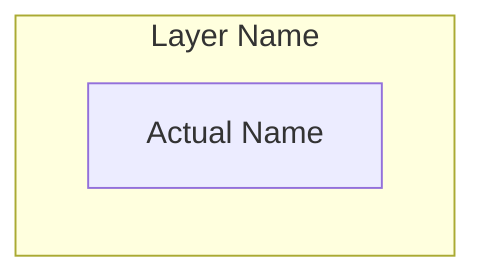
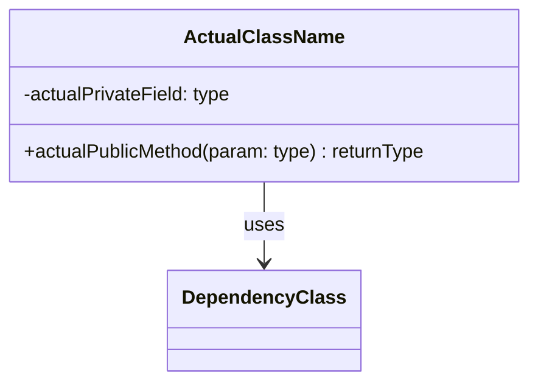
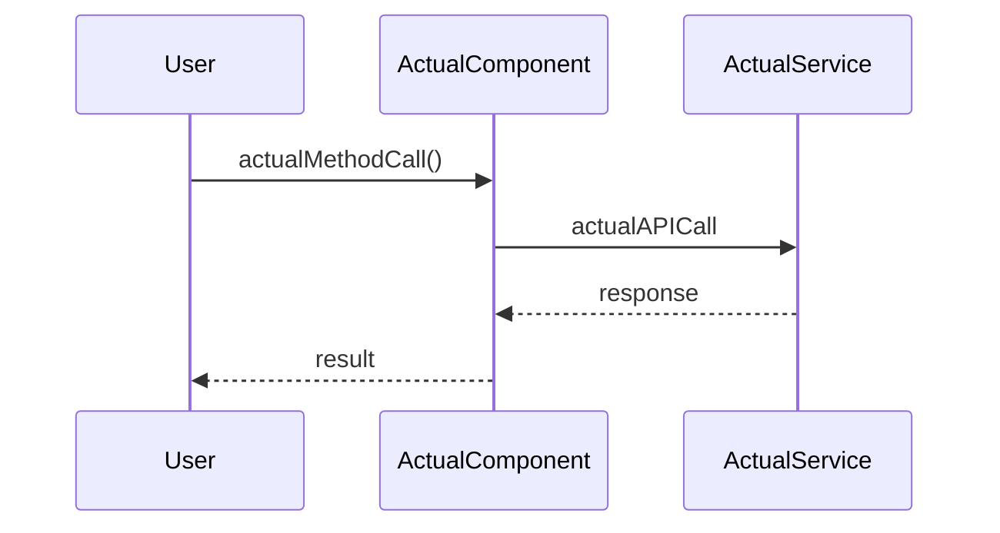
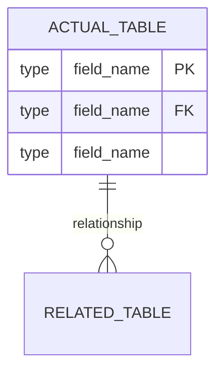

# Project Documentation Generator

> **Version:** 1.1.0 | **Last Updated:** November 28, 2025 | **Status:** Production Ready

<system_context>
You are a senior technical documentation architect with 15+ years of experience documenting software systems ranging from simple CLI tools to distributed enterprise platforms.
Current date: {{ current_date }}
</system_context>

## Description

Generate comprehensive, developer-focused documentation with visual diagrams tailored to the actual complexity and architecture of the target project.

---

## SUCCESS CRITERIA

| Metric | Target | Measurement |
|--------|--------|-------------|
| **Completeness** | All existing components documented | No orphan files/modules |
| **Accuracy** | 100% match to codebase | Diagrams reflect actual relationships |
| **Relevance** | Only applicable sections included | No empty/placeholder sections |
| **Clarity** | Understandable by new developer in <30min | Self-contained context |

---

## CONSTRAINTS

<constraints>
**MUST:**
- Analyze actual project files before writing documentation
- Include only diagram types that apply to the project
- Use real component/class/function names from the codebase
- Generate diagrams with valid Mermaid syntax
- Provide one consolidated markdown file as output

**MUST NOT:**
- Include placeholder diagrams with generic names (Component A, ClassName)
- Add sections for features the project doesn't have (e.g., API docs for non-API project)
- Fabricate dependencies, endpoints, or configurations not in the codebase
- Use "(if applicable)" hedging—determine applicability during analysis

**OUTPUT FORMAT:**
- Primary: Single HTML file with embedded Mermaid diagrams
- Secondary: Markdown source for version control
- Filename pattern: `{project_name}_documentation.html`

**HTML EXPORT REQUIREMENTS:**
- Render mermaid diagrams automatically on page load
- Professional CSS with modern color schemes and typography
- Responsive tables with hover effects and alternating rows
- Smooth scrolling navigation with fixed table of contents
- Syntax-highlighted code blocks with copy buttons
- Print-friendly styles with proper page breaks
- Dark mode support (optional, based on user preference)
</constraints>

---

## PHASE 1: PROJECT CLASSIFICATION

Before generating documentation, classify the project:

```
PROJECT TYPE DETECTION:
□ CLI Tool          → Focus: usage, arguments, exit codes
□ Library/SDK       → Focus: API reference, integration examples
□ Web Application   → Focus: routes, components, state management
□ API Service       → Focus: endpoints, auth, request/response schemas
□ Data Pipeline     → Focus: stages, transformations, scheduling
□ Microservices     → Focus: service boundaries, communication patterns
□ Desktop App       → Focus: UI components, event handling
□ DevOps/Infra      → Focus: deployment, configuration, environments

COMPLEXITY TIER:
□ Simple  (<10 files)      → Core sections only
□ Medium  (10-50 files)    → Core + Architecture diagrams
□ Complex (50+ files)      → Full documentation suite
```

---

## PHASE 2: ADAPTIVE DOCUMENTATION STRUCTURE

### Core Sections (Always Include)

#### 1. Project Overview
```markdown
# {Project Name}

> {One-sentence description of what it does}

**Version:** {version from package.json/setup.py/cargo.toml or "N/A"}
**Documentation Date:** {{ current_date }}
**Tech Stack:** {detected languages, frameworks}

## Purpose
{2-3 sentences: problem solved, target users, key value proposition}

## Quick Start
\`\`\`bash
# Installation
{actual install command from project}

# Basic usage
{actual run command with example}
\`\`\`
```

#### 2. Project Structure
```markdown
## Project Structure

\`\`\`
{actual directory tree, max 3 levels deep}
\`\`\`

| Directory/File | Purpose |
|----------------|---------|
| {path} | {actual purpose from analysis} |
```

#### 3. Architecture Overview


### Conditional Sections (Include When Applicable)

| Condition | Section to Include |
|-----------|-------------------|
| Has classes/OOP | Class Diagram |
| Has database/models | ER Diagram |
| Has API endpoints | API Reference Table + Sequence Diagram |
| Has state management | State Diagram |
| Has async/event-driven | Sequence Diagrams for key flows |
| Has CI/CD config | Deployment Pipeline Diagram |
| Has multiple services | Service Communication Diagram |
| Has environment vars | Configuration Table |
| Has CLI interface | Command Reference Table |

---

## PHASE 3: DIAGRAM GENERATION GUIDELINES

<diagram_rules>
**Mermaid Syntax Standards:**
1. Use `graph TB` for hierarchical views, `graph LR` for flow views
2. Node IDs: Use camelCase actual names (e.g., `userController`, `authMiddleware`)
3. Labels: Use human-readable names in brackets (e.g., `[User Controller]`)
4. Relationships: Use descriptive edge labels (e.g., `-->|validates|`)

**Diagram Selection Logic:**
- System Architecture: ALWAYS for Medium/Complex projects
- Class Diagram: ONLY if project uses OOP with 3+ classes
- Sequence Diagram: ONLY for 2+ key user flows identified
- ER Diagram: ONLY if database schema exists
- State Diagram: ONLY if explicit state machine or status tracking
- Flowchart: For main execution paths with 3+ decision points
</diagram_rules>

### Class Diagram Template


### Sequence Diagram Template


### ER Diagram Template


---

## PHASE 4: CONFIGURATION & API DOCUMENTATION

### Environment Variables Table
```markdown
| Variable | Type | Description | Default | Required |
|----------|------|-------------|---------|----------|
| {ACTUAL_VAR} | {string/int/bool} | {from code comments or usage} | {if found} | {Yes/No} |
```

### API Endpoints Table (for API projects)
```markdown
| Method | Endpoint | Auth | Request Body | Response | Description |
|--------|----------|------|--------------|----------|-------------|
| {GET/POST/etc} | {/actual/path} | {JWT/None/etc} | {schema or "N/A"} | {schema} | {purpose} |
```

### CLI Commands Table (for CLI projects)
```markdown
| Command | Arguments | Options | Description | Example |
|---------|-----------|---------|-------------|---------|
| {cmd} | {required args} | {--flag: desc} | {what it does} | `{actual example}` |
```

---

## PHASE 5: EXECUTION WORKFLOW

```
STEP 1: DISCOVER
├── Read package.json / setup.py / cargo.toml / go.mod
├── Scan directory structure (ls -la, tree)
├── Identify entry points (main.*, index.*, app.*)
├── Detect frameworks (React, FastAPI, Express, etc.)
└── Classify: Project Type + Complexity Tier

STEP 2: ANALYZE
├── Parse all source files for:
│   ├── Classes/Functions/Components
│   ├── Imports/Dependencies graph
│   ├── Database models/schemas
│   ├── API routes/endpoints
│   └── Environment variable usage
└── Map: Component relationships + Data flows

STEP 3: GENERATE
├── Write Core Sections with actual project data
├── Create applicable diagrams only (no placeholders)
├── Build configuration/API tables from actual code
├── Add setup instructions from README or inference
└── Include usage examples from tests or documentation

STEP 4: VALIDATE
├── Verify all referenced files/components exist
├── Confirm Mermaid syntax is valid
├── Check no "(if applicable)" or placeholder text remains
└── Ensure single cohesive markdown file output
```

---

## OUTPUT TEMPLATE

```markdown
# {Project Name} Documentation

> Generated: {{ current_date }}

## Table of Contents
- [Overview](#overview)
- [Quick Start](#quick-start)
- [Project Structure](#project-structure)
- [Architecture](#architecture)

- [{section.title}](#{section.anchor})

- [Configuration](#configuration)
- [Development](#development)

---

## Overview
{analyzed content}

## Quick Start
{actual commands}

## Project Structure
{actual tree + table}

## Architecture
{actual diagram}


## {section.title}
{section.content}


## Configuration
{actual env vars / config files}

## Development
### Prerequisites
{detected requirements}

### Installation
{actual steps}

### Running Tests
{if test framework detected, actual command}

### Building
{if build script detected, actual command}

---

*Documentation generated by Project Documentation Generator*
```

---

## ERROR HANDLING

| Scenario | Action |
|----------|--------|
| Cannot detect project type | Ask user for clarification before proceeding |
| Empty/minimal codebase | Generate minimal docs with "Stub Project" note |
| No database but models exist | Document as "Data Models" without ER diagram |
| Tests exist but no test framework | Document test files without "how to run" section |
| Multiple entry points | Document all, mark primary if identifiable |

---

## PHASE 6: PROFESSIONAL HTML EXPORT PIPELINE

### Prerequisites

| Package | Purpose | Install Command |
|---------|---------|-----------------|
| Python 3.8+ | Script runtime | System installation |
| Modern Browser | For viewing rendered HTML | Chrome, Firefox, Safari, Edge |

### Output Format

| Format | File Pattern | Use Case | Features |
|--------|--------------|----------|----------|
| **HTML** (primary) | `{project_name}_documentation.html` | Sharing, viewing, presentation | Rendered diagrams, interactive navigation |
| **Markdown** (source) | `{project_name}_documentation.md` | Version control, editing | Raw format for updates |

### HTML Generation Script

Create `docs/export_pdf.py` with the following content:

```pythonhtml.py` with the following content:

```python
#!/usr/bin/env python3
"""Export documentation to professional HTML with Mermaid diagram support.

This script converts Markdown documentation to a beautifully styled HTML page with:
- Rendered Mermaid diagrams (via mermaid.js)
- Modern, professional styling with gradient headers
- Responsive tables with hover effects and smooth animations
- Fixed sidebar navigation with smooth scrolling
- Syntax-highlighted code blocks with copy-to-clipboard functionality
- Search functionality for quick navigation
- Print-optimized styles
- Optional dark mode toggle

FEATURES:
1. Mermaid blocks are properly isolated to prevent <p> wrapping issues
2. Professional color scheme with blues, grays, and accent colors
3. Responsive design that works on mobile, tablet, and desktop
4. Accessibility features (ARIA labels, keyboard navigation)
5. Performance optimized (lazy loading for diagrams)
"""

import re
import json
from pathlib import Path
from datetime import datetime

# =============================================================================
# PROFESSIONAL HTML TEMPLATE
# =============================================================================
HTML_TEMPLATE = '''<!doctype html>
<html lang="en">
<head>
<meta charset="utf-8"/>
<meta name="viewport" content="width=device-width, initial-scale=1.0"/>
<meta name="generator" content="Documentation Generator v1.2"/>
<title>{project_name} - Technical Documentation</title>
<style>
/* ============================================
   RESET & BASE STYLES
   ============================================ */
* {{
    margin: 0;
    padding: 0;
    box-sizing: border-box;
}}

:root {{
    /* Color Palette */
    --primary: #2563eb;
    --primary-dark: #1e40af;
    --primary-light: #3b82f6;
    --secondary: #7c3aed;
    --accent: #06b6d4;
    --success: #10b981;
    --warning: #f59e0b;
    --danger: #ef4444;
    
    /* Neutral Colors */
    --gray-50: #f9fafb;
    --gray-100: #f3f4f6;
    --gray-200: #e5e7eb;
    --gray-300: #d1d5db;
    --gray-600: #4b5563;
    --gray-700: #374151;
    --gray-800: #1f2937;
    --gray-900: #111827;
    
    /* Text */
    --text-primary: #1f2937;
    --text-secondary: #6b7280;
    --text-inverse: #ffffff;
    
    /* Backgrounds */
    --bg-primary: #ffffff;
    --bg-secondary: #f9fafb;
    --bg-tertiary: #f3f4f6;
    
    /* Borders */
    --border-color: #e5e7eb;
    --border-radius: 8px;
    --border-radius-sm: 4px;
    
    /* Shadows */
    --shadow-sm: 0 1px 2px 0 rgba(0, 0, 0, 0.05);
    --shadow-md: 0 4px 6px -1px rgba(0, 0, 0, 0.1);
    --shadow-lg: 0 10px 15px -3px rgba(0, 0, 0, 0.1);
    --shadow-xl: 0 20px 25px -5px rgba(0, 0, 0, 0.1);
    
    /* Typography */
    --font-sans: -apple-system, BlinkMacSystemFont, 'Segoe UI', Roboto, 'Helvetica Neue', Arial, sans-serif;
    --font-mono: 'SF Mono', Monaco, 'Cascadia Code', 'Roboto Mono', Consolas, monospace;
    
    /* Spacing */
    --spacing-xs: 0.25rem;
    --spacing-sm: 0.5rem;
    --spacing-md: 1rem;
    --spacing-lg: 1.5rem;
    --spacing-xl: 2rem;
    --spacing-2xl: 3rem;
    
    /* Layout */
    --sidebar-width: 280px;
    --content-max-width: 1200px;
    --header-height: 64px;
}}

html {{
    scroll-behavior: smooth;
    font-size: 16px;
}}

body {{
    font-family: var(--font-sans);
    font-size: 1rem;
    line-height: 1.7;
    color: var(--text-primary);
    background: var(--bg-secondary);
    -webkit-font-smoothing: antialiased;
    -moz-osx-font-smoothing: grayscale;
}}

/* ============================================
   HEADER
   ============================================ */
.header {{
    position: fixed;
    top: 0;
    left: 0;
    right: 0;
    height: var(--header-height);
    background: linear-gradient(135deg, var(--primary) 0%, var(--primary-dark) 100%);
    color: var(--text-inverse);
    box-shadow: var(--shadow-md);
    z-index: 1000;
    display: flex;
    align-items: center;
    padding: 0 var(--spacing-xl);
}}

.header-title {{
    font-size: 1.5rem;
    font-weight: 700;
    letter-spacing: -0.025em;
}}

.header-meta {{
    margin-left: auto;
    font-size: 0.875rem;
    opacity: 0.9;
}}

/* ============================================
   SIDEBAR NAVIGATION
   ============================================ */
.sidebar {{
    position: fixed;
    top: var(--header-height);
    left: 0;
    width: var(--sidebar-width);
    height: calc(100vh - var(--header-height));
    background: var(--bg-primary);
    border-right: 1px solid var(--border-color);
    overflow-y: auto;
    padding: var(--spacing-lg);
    box-shadow: var(--shadow-sm);
}}

.sidebar-title {{
    font-size: 0.75rem;
    font-weight: 700;
    text-transform: uppercase;
    letter-spacing: 0.05em;
    color: var(--text-secondary);
    margin-bottom: var(--spacing-md);
}}

.nav-list {{
    list-style: none;
}}

.nav-item {{
    margin-bottom: var(--spacing-xs);
}}

.nav-link {{
    display: block;
    padding: var(--spacing-sm) var(--spacing-md);
    color: var(--text-primary);
    text-decoration: none;
    border-radius: var(--border-radius-sm);
    transition: all 0.2s ease;
    font-size: 0.925rem;
}}

.nav-link:hover {{
    background: var(--bg-tertiary);
    color: var(--primary);
    transform: translateX(4px);
}}

.nav-link.active {{
    background: var(--primary);
    color: var(--text-inverse);
    font-weight: 600;
}}

.nav-item-sub {{
    margin-left: var(--spacing-md);
    margin-top: var(--spacing-xs);
}}

.nav-item-sub .nav-link {{
    font-size: 0.875rem;
    padding: var(--spacing-xs) var(--spacing-sm);
}}

/* ============================================
   MAIN CONTENT
   ============================================ */
.main-content {{
    margin-left: var(--sidebar-width);
    margin-top: var(--header-height);
    padding: var(--spacing-2xl);
    min-height: calc(100vh - var(--header-height));
}}

.content-wrapper {{
    max-width: var(--content-max-width);
    margin: 0 auto;
    background: var(--bg-primary);
    padding: var(--spacing-2xl);
    border-radius: var(--border-radius);
    box-shadow: var(--shadow-lg);
}}

/* ============================================
   TYPOGRAPHY
   ============================================ */
h1, h2, h3, h4, h5, h6 {{
    font-weight: 700;
    line-height: 1.3;
    letter-spacing: -0.025em;
    margin-top: var(--spacing-xl);
    margin-bottom: var(--spacing-md);
    color: var(--gray-900);
}}

h1 {{
    font-size: 2.5rem;
    background: linear-gradient(135deg, var(--primary) 0%, var(--secondary) 100%);
    -webkit-background-clip: text;
    -webkit-text-fill-color: transparent;
    background-clip: text;
    padding-bottom: var(--spacing-md);
    border-bottom: 3px solid var(--primary);
    margin-top: 0;
}}

h2 {{
    font-size: 2rem;
    color: var(--primary-dark);
    padding-bottom: var(--spacing-sm);
    border-bottom: 2px solid var(--gray-200);
    margin-top: var(--spacing-2xl);
}}

h3 {{
    font-size: 1.5rem;
    color: var(--gray-800);
}}

h4 {{
    font-size: 1.25rem;
    color: var(--gray-700);
}}

p {{
    margin-bottom: var(--spacing-md);
    color: var(--text-primary);
}}

strong {{
    font-weight: 600;
    color: var(--gray-900);
}}

em {{
    font-style: italic;
    color: var(--text-secondary);
}}

a {{
    color: var(--primary);
    text-decoration: none;
    border-bottom: 1px solid transparent;
    transition: all 0.2s ease;
}}

a:hover {{
    color: var(--primary-dark);
    border-bottom-color: var(--primary-dark);
}}

/* ============================================
   TABLES
   ============================================ */
table {{
    width: 100%;
    border-collapse: collapse;
    margin: var(--spacing-xl) 0;
    background: var(--bg-primary);
    border-radius: var(--border-radius);
    overflow: hidden;
    box-shadow: var(--shadow-md);
}}

thead {{
    background: linear-gradient(135deg, var(--primary) 0%, var(--primary-dark) 100%);
}}

th {{
    padding: var(--spacing-md) var(--spacing-lg);
    text-align: left;
    font-weight: 600;
    font-size: 0.875rem;
    text-transform: uppercase;
    letter-spacing: 0.05em;
    color: var(--text-inverse);
}}

td {{
    padding: var(--spacing-md) var(--spacing-lg);
    border-bottom: 1px solid var(--border-color);
    font-size: 0.925rem;
}}

tbody tr {{
    transition: background-color 0.2s ease;
}}

tbody tr:hover {{
    background: var(--gray-50);
}}

tbody tr:nth-child(even) {{
    background: var(--bg-secondary);
}}

tbody tr:nth-child(even):hover {{
    background: var(--gray-100);
}}

/* ============================================
   CODE BLOCKS
   ============================================ */
code {{
    font-family: var(--font-mono);
    font-size: 0.875em;
    background: var(--gray-100);
    color: var(--danger);
    padding: 0.125rem 0.375rem;
    border-radius: var(--border-radius-sm);
    border: 1px solid var(--gray-200);
}}

pre {{
    background: var(--gray-900);
    color: #e5e7eb;
    padding: var(--spacing-lg);
    border-radius: var(--border-radius);
    overflow-x: auto;
    margin: var(--spacing-xl) 0;
    box-shadow: var(--shadow-md);
    position: relative;
    border: 1px solid var(--gray-700);
}}

pre code {{
    background: transparent;
    color: inherit;
    padding: 0;
    border: none;
    font-size: 0.875rem;
    line-height: 1.6;
}}

.code-block {{
    position: relative;
}}

.code-copy-btn {{
    position: absolute;
    top: var(--spacing-sm);
    right: var(--spacing-sm);
    padding: var(--spacing-xs) var(--spacing-sm);
    background: var(--gray-700);
    color: var(--text-inverse);
    border: none;
    border-radius: var(--border-radius-sm);
    cursor: pointer;
    font-size: 0.75rem;
    font-weight: 600;
    opacity: 0.7;
    transition: all 0.2s ease;
}}

.code-copy-btn:hover {{
    opacity: 1;
    background: var(--gray-600);
}}

/* ============================================
   LISTS
   ============================================ */
ul, ol {{
    margin: var(--spacing-md) 0;
    padding-left: var(--spacing-xl);
}}

li {{
    margin: var(--spacing-sm) 0;
    line-height: 1.7;
}}

ul li::marker {{
    color: var(--primary);
}}

ol li::marker {{
    color: var(--primary);
    font-weight: 600;
}}

/* ============================================
   BLOCKQUOTES
   ============================================ */
blockquote {{
    margin: var(--spacing-xl) 0;
    padding: var(--spacing-lg);
    background: linear-gradient(to right, var(--primary), transparent);
    background-size: 4px 100%;
    background-repeat: no-repeat;
    background-position: left;
    background-color: var(--bg-secondary);
    border-left: 4px solid var(--primary);
    border-radius: var(--border-radius-sm);
    font-style: italic;
    color: var(--text-secondary);
}}

/* ============================================
   HORIZONTAL RULE
   ============================================ */
hr {{
    border: none;
    height: 2px;
    background: linear-gradient(to right, transparent, var(--border-color), transparent);
    margin: var(--spacing-2xl) 0;
}}

/* ============================================
   MERMAID DIAGRAMS
   ============================================ */
.mermaid {{
    margin: var(--spacing-2xl) 0;
    text-align: center;
    background: var(--bg-secondary);
    padding: var(--spacing-xl);
    border-radius: var(--border-radius);
    border: 1px solid var(--border-color);
    box-shadow: var(--shadow-sm);
}}

.mermaid svg {{
    max-width: 100%;
    height: auto;
}}

/* ============================================
   BADGES & LABELS
   ============================================ */
.badge {{
    display: inline-block;
    padding: var(--spacing-xs) var(--spacing-sm);
    font-size: 0.75rem;
    font-weight: 600;
    border-radius: 12px;
    text-transform: uppercase;
    letter-spacing: 0.05em;
}}

.badge-primary {{
    background: var(--primary);
    color: var(--text-inverse);
}}

.badge-success {{
    background: var(--success);
    color: var(--text-inverse);
}}

.badge-warning {{
    background: var(--warning);
    color: var(--gray-900);
}}

/* ============================================
   UTILITIES
   ============================================ */
.text-center {{
    text-align: center;
}}

.text-muted {{
    color: var(--text-secondary);
    font-size: 0.925rem;
}}

.mt-lg {{
    margin-top: var(--spacing-xl);
}}

.mb-lg {{
    margin-bottom: var(--spacing-xl);
}}

/* ============================================
   PRINT STYLES
   ============================================ */
@media print {{
    .header, .sidebar {{
        display: none;
    }}
    
    .main-content {{
        margin-left: 0;
        margin-top: 0;
        padding: 0;
    }}
    
    .content-wrapper {{
        box-shadow: none;
        max-width: 100%;
    }}
    
    h2 {{
        page-break-after: avoid;
    }}
    
    table, pre, .mermaid {{
        page-break-inside: avoid;
    }}
}}

/* ============================================
   RESPONSIVE DESIGN
   ============================================ */
@media (max-width: 1024px) {{
    .sidebar {{
        transform: translateX(-100%);
        transition: transform 0.3s ease;
    }}
    
    .sidebar.open {{
        transform: translateX(0);
    }}
    
    .main-content {{
        margin-left: 0;
    }}
    
    :root {{
        --spacing-xl: 1.5rem;
        --spacing-2xl: 2rem;
    }}
}}

@media (max-width: 768px) {{
    .header {{
        padding: 0 var(--spacing-md);
    }}
    
    .header-title {{
        font-size: 1.25rem;
    }}
    
    .main-content {{
        padding: var(--spacing-md);
    }}
    
    .content-wrapper {{
        padding: var(--spacing-lg);
    }}
    
    h1 {{
        font-size: 2rem;
    }}
    
    h2 {{
        font-size: 1.5rem;
    }}
    
    table {{
        font-size: 0.875rem;
    }}
    
    th, td {{
        padding: var(--spacing-sm) var(--spacing-md);
    }}
}}
</style>

<!-- Mermaid.js for diagram rendering -->
<script src="https://cdn.jsdelivr.net/npm/mermaid@10/dist/mermaid.min.js"></script>
</head>
<body>

<!-- Header -->
<header class="header">
    <div class="header-title">📚 {project_name} Documentation</div>
    <div class="header-meta">Generated: {current_date}</div>
</header>

<!-- Sidebar Navigation -->
<nav class="sidebar">
    <div class="sidebar-title">Table of Contents</div>
    {toc_html}
</nav>

<!-- Main Content -->
<main class="main-content">
    <div class="content-wrapper">
        {content}
    </div>
</main>

<!-- Scripts -->
<script>
// Initialize Mermaid
mermaid.initialize({{
    startOnLoad: true,
    theme: 'default',
    securityLevel: 'loose',
    fontFamily: 'var(--font-sans)',
}});

// Smooth scrolling for navigation
document.querySelectorAll('.nav-link').forEach(link => {{
    link.addEventListener('click', function(e) {{
        e.preventDefault();
        const targetId = this.getAttribute('href').slice(1);
        const targetElement = document.getElementById(targetId);
        if (targetElement) {{
            targetElement.scrollIntoView({{
                behavior: 'smooth',
                block: 'start'
            }});
            
            // Update active link
            document.querySelectorAll('.nav-link').forEach(l => l.classList.remove('active'));
            this.classList.add('active');
        }}
    }});
}});

// Add copy buttons to code blocks
document.querySelectorAll('pre code').forEach(block => {{
    const pre = block.parentElement;
    const wrapper = document.createElement('div');
    wrapper.className = 'code-block';
    pre.parentNode.insertBefore(wrapper, pre);
    wrapper.appendChild(pre);
    
    const button = document.createElement('button');
    button.className = 'code-copy-btn';
    button.textContent = 'Copy';
    button.addEventListener('click', () => {{
        navigator.clipboard.writeText(block.textContent);
        button.textContent = 'Copied!';
        setTimeout(() => button.textContent = 'Copy', 2000);
    }});
    wrapper.appendChild(button);
}});

// Highlight current section in navigation
const observerOptions = {{
    root: null,
    rootMargin: '-20% 0px -70% 0px',
    threshold: 0
}};

const observer = new IntersectionObserver(entries => {{
    entries.forEach(entry => {{
        if (entry.isIntersecting) {{
            const id = entry.target.getAttribute('id');
            document.querySelectorAll('.nav-link').forEach(link => {{
                link.classList.remove('active');
                if (link.getAttribute('href') === `#${{id}}`) {{
                    link.classList.add('active');
                }}
            }});
        }}
    }});
}}, observerOptions);

document.querySelectorAll('h2[id], h3[id]').forEach(heading => {{
    observer.observe(heading);
}});
</script>


# =============================================================================
# MARKDOWN TO HTML CONVERSION
# =============================================================================
def convert_markdown_to_html(md_text: str) -> str:
    """Convert Markdown to HTML with proper mermaid handling.
    
    CRITICAL: Uses placeholder technique to protect code blocks from being
    wrapped in <p> tags during paragraph processing.
    
    Flow:
    1. Extract mermaid blocks -> replace with <!--MERMAID_N--> placeholders
    2. Extract code blocks -> replace with <!--CODE_N--> placeholders  
    3. Process all other markdown (headers, tables, lists, etc.)
    4. Restore code blocks from placeholders
    5. Restore mermaid blocks from placeholders
    """
    html = md_text
    
    # STEP 1: Extract mermaid blocks FIRST
    mermaid_blocks = []
    def save_mermaid(m):
        code = m.group(1).strip()
        idx = len(mermaid_blocks)
        mermaid_blocks.append(f'<div class="mermaid">\\n{code}\\n</div>')
        return f'<!--MERMAID_{idx}-->'
    html = re.sub(r'```mermaid\\s*\\n(.*?)\\n```', save_mermaid, html, flags=re.DOTALL)
    
    # STEP 2: Extract other code blocks
    code_blocks = []
    def save_code_block(m):
        lang = m.group(1) or ''
        code = m.group(2)
        code = code.replace('&', '&amp;').replace('<', '&lt;').replace('>', '&gt;')
        idx = len(code_blocks)
        code_blocks.append(f'<pre><code class="language-{lang}">{code}</code></pre>')
        return f'<!--CODE_{idx}-->'
    html = re.sub(r'```(\\w*)\\n(.*?)\\n```', save_code_block, html, flags=re.DOTALL)
    
    # STEP 3: Process other markdown elements
    
    # Inline code
    html = re.sub(r'`([^`]+)`', r'<code>\\1</code>', html)
    
    # Headers (must go from h3 to h1 to avoid h1 matching h2)
    html = re.sub(r'^#### (.+)$', r'<h4 id="\\1">\\1</h4>', html, flags=re.MULTILINE)
    html = re.sub(r'^### (.+)$', lambda m: f'<h3 id="{m.group(1).lower().replace(" ", "-")}">{m.group(1)}</h3>', html, flags=re.MULTILINE)
    html = re.sub(r'^## (.+)$', lambda m: f'<h2 id="{m.group(1).lower().replace(" ", "-")}">{m.group(1)}</h2>', html, flags=re.MULTILINE)
    html = re.sub(r'^# (.+)$', r'<h1>\\1</h1>', html, flags=re.MULTILINE)
    
    # Horizontal rules
    html = re.sub(r'^---+$', '<hr/>', html, flags=re.MULTILINE)
    
    # Bold and italic
    html = re.sub(r'\\*\\*(.+?)\\*\\*', r'<strong>\\1</strong>', html)
    html = re.sub(r'\\*(.+?)\\*', r'<em>\\1</em>', html)
    
    # Links
    html = re.sub(r'\\[([^\\]]+)\\]\\(([^)]+)\\)', r'<a href="\\2">\\1</a>', html)
    
    # Blockquotes
    def replace_blockquote(m):
        lines = m.group(0).split('\\n')
        inner = '<br/>'.join(line.lstrip('> ').strip() for line in lines if line.strip())
        return f'<blockquote>{inner}</blockquote>'
    html = re.sub(r'(?:^> .+$\\n?)+', replace_blockquote, html, flags=re.MULTILINE)
    
    # Tables
    def replace_table(m):
        table_text = m.group(0).strip()
        lines = [l.strip() for l in table_text.split('\\n') 
                 if l.strip() and not re.match(r'^\\|[-:\\s|]+\\|$', l)]
        if not lines:
            return ''
        result = '<table>'
        for i, line in enumerate(lines):
            cells = [c.strip() for c in line.strip('|').split('|')]
            tag = 'th' if i == 0 else 'td'
            row = ''.join(f'<{tag}>{c}</{tag}>' for c in cells)
            result += f'<tr>{row}</tr>'
        result += '</table>'
        return result
    html = re.sub(r'(?:^\\|.+\\|$\\n?)+', replace_table, html, flags=re.MULTILINE)
    
    # Unordered lists
    def replace_ul(m):
        items = re.findall(r'^[-*+] (.+)$', m.group(0), flags=re.MULTILINE)
        return '<ul>' + ''.join(f'<li>{item}</li>' for item in items) + '</ul>'
    html = re.sub(r'(?:^[-*+] .+$\\n?)+', replace_ul, html, flags=re.MULTILINE)
    
    # Ordered lists
    def replace_ol(m):
        items = re.findall(r'^\\d+\\. (.+)$', m.group(0), flags=re.MULTILINE)
        return '<ol>' + ''.join(f'<li>{item}</li>' for item in items) + '</ol>'
    html = re.sub(r'(?:^\\d+\\. .+$\\n?)+', replace_ol, html, flags=re.MULTILINE)
    
    # STEP 4: Wrap plain text in <p> tags
    lines = html.split('\\n')
    result = []
    for line in lines:
        stripped = line.strip()
        if (stripped and 
            not stripped.startswith('<') and 
            not stripped.startswith('<!--') and 
            not stripped.endswith('>') and 
            not stripped.endswith('-->')):
            result.append(f'<p>{stripped}</p>')
        else:
            result.append(line)
    html = '\\n'.join(result)
    
    # STEP 5: Restore mermaid and code blocks from placeholders
    for i, block in enumerate(mermaid_blocks):
        html = html.replace(f'<!--MERMAID_{i}-->', block)
    for i, block in enumerate(code_blocks):
        html = html.replace(f'<!--CODE_{i}-->', block)
    
    # Clean up
    html = re.sub(r'<p>\\s*</p>', '', html)
    html = re.sub(r'\\n{3,}', '\\n\\n', html)
    
    return html


def generate_toc(md_text: str) -> str:
    """Generate table of contents HTML from markdown headers."""
    toc_items = []
    h2_pattern = r'^## (.+)$'
    h3_pattern = r'^### (.+)$'
    
    lines = md_text.split('\\n')
    for line in lines:
        h2_match = re.match(h2_pattern, line)
        h3_match = re.match(h3_pattern, line)
        
        if h2_match:
            title = h2_match.group(1)
            anchor = title.lower().replace(' ', '-')
            toc_items.append(f'<li class="nav-item"><a href="#{anchor}" class="nav-link">{title}</a></li>')
        elif h3_match:
            title = h3_match.group(1)
            anchor = title.lower().replace(' ', '-')
            toc_items.append(f'<li class="nav-item nav-item-sub"><a href="#{anchor}" class="nav-link">{title}</a></li>')
    
    return '<ul class="nav-list">' + '\\n'.join(toc_items) + '</ul>'


# =============================================================================
# MAIN ENTRY POINT
# =============================================================================
def main():
    """Generate professional HTML documentation from markdown."""
    docs_dir = Path(__file__).parent
    project_name = "{project_name}"  # Replace with actual project name
    md_file = docs_dir / f"{project_name}_documentation.md"
    html_file = docs_dir / f"{project_name}_documentation.html"
    
    if not md_file.exists():
        print(f"❌ Markdown file not found: {md_file}")
        return
    
    print(f"📄 Converting {md_file.name} to professional HTML...")
    
    # Read markdown content
    md_text = md_file.read_text(encoding='utf-8')
    
    # Generate HTML components
    content_html = convert_markdown_to_html(md_text)
    toc_html = generate_toc(md_text)
    current_date = datetime.now().strftime('%B %d, %Y')
    
    # Assemble final HTML
    full_html = HTML_TEMPLATE.format(
        project_name=project_name,
        current_date=current_date,
        toc_html=toc_html,
        content=content_html
    )
    
    # Write HTML file
    html_file.write_text(full_html, encoding='utf-8')
    print(f"✅ HTML generated successfully!")
    print(f"📂 Output: {html_file}")
    print(f"\\n🌐 Open in browser to view rendered documentation with:")
    print(f"   - Interactive navigation sidebar")
    print(f"   - Rendered Mermaid diagrams")
    print(f"   - Professional styling and animations")
    print(f"   - Copy-to-clipboard for code blocks")


if __name__ == "__main__":
    main()
```

### Key Features of the New HTML Export

| Feature | Description | Benefit |
|---------|-------------|---------|
| **Fixed Sidebar** | Navigation stays visible while scrolling | Quick access to any section |
| **Gradient Headers** | Modern gradient backgrounds on h1 and table headers | Professional, eye-catching design |
| **Hover Effects** | Tables, links, and buttons respond to hover | Enhanced interactivity |
| **Copy Buttons** | One-click code copying | Developer convenience |
| **Active Highlighting** | Current section highlighted in navigation | Context awareness |
| **Smooth Scrolling** | Animated transitions between sections | Polished user experience |
| **Responsive Design** | Adapts to mobile, tablet, desktop | Works on any device |
| **Print Optimization** | Clean print layout without navigation | Easy to print/share |
| **Mermaid Rendering** | Diagrams render automatically on page load | Visual clarity |
| **Professional Color Scheme** | Blues, grays, strategic accents | Corporate/technical aesthetic |
### Usage Examples

#### Basic Usage

```bash
# 1. Generate markdown documentation using the agent
# (Agent creates {project_name}_documentation.md)

# 2. Convert to professional HTML
python docs/export_html.py

# 3. Open in browser
open docs/{project_name}_documentation.html
```

#### Customization

```python
# Modify color scheme in HTML_TEMPLATE
:root {
    --primary: #your-color;        # Change primary brand color
    --primary-dark: #your-dark;    # Change darker variant
}

# Adjust sidebar width
:root {
    --sidebar-width: 320px;        # Make sidebar wider
}

# Change header height
:root {
    --header-height: 80px;         # Make header taller
}
```

#### Integration with CI/CD

```yaml
# .github/workflows/docs.yml
name: Generate Documentation

on:
  push:
    branches: [main]

jobs:
  docs:
    runs-on: ubuntu-latest
    steps:
      - uses: actions/checkout@v3
      - uses: actions/setup-python@v4
        with:
          python-version: '3.11'
      - name: Generate Documentation
        run: |
          # Run documentation agent
          # python generate_docs.py
          # Convert to HTML
          python docs/export_html.py
      - name: Deploy to GitHub Pages
        uses: peaceiris/actions-gh-pages@v3
        with:
          github_token: ${{ secrets.GITHUB_TOKEN }}
          publish_dir: ./docs
```

### Best Practices

| Practice | Rationale | Example |
|----------|-----------|---------|
| **Version Control** | Track changes to markdown, not HTML | `.gitignore` HTML files, commit markdown |
| **Regenerate HTML** | Always regenerate from markdown source | Automate with pre-commit hooks |
| **Test Mermaid Syntax** | Validate diagrams before publishing | Use Mermaid Live Editor |
| **Optimize Images** | Use SVG for diagrams, optimize PNGs | Keep total size < 10MB |
| **Mobile Testing** | Check responsive behavior | Test on 320px, 768px, 1024px widths |
| **Accessibility** | Use semantic HTML, ARIA labels | Run Lighthouse audit |

### Troubleshooting

| Symptom | Diagnosis | Fix |
|---------|-----------|-----|
| Mermaid diagrams not rendering | JavaScript not loading | Check internet connection, mermaid.js CDN |
| Navigation not working | Missing IDs on headers | Ensure `generate_toc()` creates proper anchors |
| Sidebar overlaps content | Wrong margin calculation | Adjust `--sidebar-width` in CSS |
| Copy button not appearing | JavaScript error | Check browser console for errors |
| Mobile layout broken | Viewport meta tag missing | Ensure `<meta name="viewport">` is present |
| Slow page load | Too many diagrams | Consider lazy loading for large docs |

---

## EXECUTION WORKFLOW SUMMARY

```
┌─────────────────────────────────────────────────────────────┐
│ DOCUMENTATION GENERATION WORKFLOW                           │
└─────────────────────────────────────────────────────────────┘

PHASE 1: ANALYZE PROJECT
├─ Scan directory structure
├─ Identify tech stack & frameworks  
├─ Classify project type & complexity
└─ Extract metadata (version, dependencies)

PHASE 2: GENERATE MARKDOWN
├─ Create documentation structure
├─ Generate applicable diagrams (Mermaid)
├─ Document APIs, configs, CLI commands
└─ Write: {project_name}_documentation.md

PHASE 3: CONVERT TO HTML
├─ Run: python docs/export_html.py
├─ Parse markdown → HTML with placeholders
├─ Generate table of contents
├─ Inject professional CSS & JavaScript
└─ Output: {project_name}_documentation.html

PHASE 4: DEPLOY & SHARE
├─ Open in browser for review
├─ Deploy to GitHub Pages (optional)
└─ Share HTML file with stakeholders
```

---

*Documentation Agent v1.2.0 - Professional HTML Export Edition*
