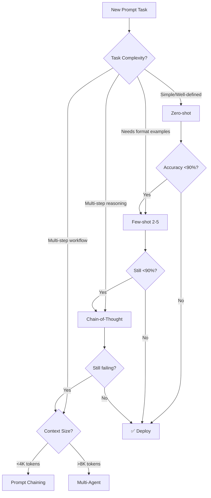

# Copilot Instructions for Prompts Collection

## Project Overview
This is a specialized prompt engineering repository containing advanced AI agent templates for automated documentation generation, project analysis, and research. The collection focuses on production-ready prompts that integrate complex workflows including state-based execution analysis, bilingual documentation generation, and automated PDF conversion with Mermaid diagram rendering.

**NEW:** Advanced prompt engineering system for planning, creating, and optimizing prompts using latest 2025 techniques (Chain-of-Thought, Context Engineering, Multi-Agent patterns).

## Core Patterns & Architecture

### Prompt Template Structure
All prompts follow a structured format with these key components:
- **ROLE & GOAL**: Clear AI persona definition with specific expertise
- **PRIMARY OBJECTIVE**: Core business outcome and deliverable requirements
- **CORE CAPABILITIES**: Numbered sections defining specific functionalities
- **STRUCTURE & INSTRUCTIONS**: Step-by-step execution methodology

### File Naming Conventions
- `.chatmode.md`: Production AI agent prompts designed for chat-based AI systems
- `_project.md`: Project documentation templates and generators
- `.py`: Reference implementations and code templates
- `SALES_PITCH_`: Business presentation versions of technical capabilities
- `PROMPT_OPTIMIZER_*`: Prompt engineering system documentation

### State-Based Workflow Analysis Pattern
Key pattern across multiple templates focusing on `main.py` execution analysis:
```
main.py → state_idx conditions → process_scripts/ → business workflow documentation
```

### Bilingual Documentation Requirements
Templates generate exactly 2 documentation files:
- `{project_name}_workflow_en.md` (English)
- `{project_name}_workflow_es.md` (Spanish)

## Key Implementation Details

### Mermaid Diagram Integration
All documentation templates include:
- **Server-side rendering** with `markdown-it` and table plugin
- **Conversion pattern**: ````mermaid` code blocks → `<div class="mermaid">` for PDF
- **Dynamic PDF sizing** based on content height using Chrome DevTools Protocol
- **Selenium automation** with proper SVG wait logic

### PDF Generation Workflow
Critical success pattern found in `analysis_project.chatmode.md`:
1. Generate bilingual markdown with embedded Mermaid diagrams
2. Convert to HTML with inline Mermaid script (avoid CDN dependencies)
3. Use Selenium + Chrome headless for PDF generation
4. Implement content height calculation for dynamic page sizing
5. Auto-cleanup temporary files leaving only final PDFs

## Development Guidelines

### When Creating New Prompts

#### 🔴 MUST (Blocking - prompt fails without these)
1. **Define success criteria BEFORE writing** - metrics, targets, evaluation method
2. **Include explicit output format specification** - structure, length, style
3. **Specify exact file naming conventions** - avoid confusion about deliverables
4. **Add essential context** - date, role, task, constraints (see checklist below)

#### 🟡 SHOULD (Quality impact)
5. **Follow the numbered capability structure** seen in existing templates
6. **Include comprehensive error handling** for framework dependencies
7. **Use context engineering principles** from prompt optimizer system
8. **Apply appropriate techniques** (Chain-of-Thought, Few-shot, XML tags)

#### 🟢 CONSIDER (Enhancement)
9. **Implement bilingual support** for international documentation needs
10. **Add Mermaid diagram specifications** for visual process documentation
11. **Add few-shot examples (2-3)** for complex or ambiguous tasks
12. **Include failure impact analysis** for business stakeholders

### Quality Standards

| Metric | Minimum | Target | Measurement |
|--------|---------|--------|-------------|
| Typical cases accuracy | 85% | 95% | Test with 10-15 cases |
| Edge cases handled | 70% | 90% | Test with 5-10 cases |
| Format compliance | 90% | 100% | Automated check |
| Zero critical failures | Required | Required | Manual review |

**Quality Checklist:**
- [ ] Each prompt includes **specific business context** extraction
- [ ] Document **state transition logic** for workflow-based systems  
- [ ] Provide **failure impact analysis** for business stakeholders
- [ ] Include **automated cleanup procedures** for temporary files
- [ ] Specify **exact technical dependencies** (selenium, markdown-it-py)
- [ ] **Define success criteria** before building
- [ ] **Test empirically** with 20+ diverse inputs (typical, edge, error)

### Debugging Common Issues
- **Blank PDFs**: Use server-side markdown rendering, not client-side only
- **Missing diagrams**: Implement proper SVG wait logic in Selenium
- **Content cut-off**: Calculate dynamic height based on `document.body.scrollHeight`
- **Import failures**: Always provide standalone fallbacks for framework utilities
- **Low accuracy**: Add Chain-of-Thought reasoning or few-shot examples
- **Inconsistent outputs**: Use XML tags and explicit constraints

## Template Categories

### Prompt Engineering System (`prompt_optimizer_agent.chatmode.md`) ⭐ NEW
- Complete prompt planning, creation, and optimization system
- Based on 2025 best practices (Anthropic, OpenAI, DAIR.AI)
- Context engineering for optimal LLM understanding
- Multi-agent design patterns
- Comprehensive testing and evaluation framework
- **Documentation**: See `PROMPT_OPTIMIZER_README.md` for full guide

### Documentation Generators (`analysis_project.chatmode.md`)
- State-based workflow analysis specialists
- Bilingual technical documentation with visual diagrams
- Automated PDF conversion with embedded graphics
- Production deployment with framework integration

### Research Templates (`prompt_deep_research.py`)
- Educational content generation with learning roadmaps
- Technical concept explanation with analogies
- Mathematical foundations with LaTeX rendering
- Curated resource compilation with authoritative links

### Project Analysis (`document_project.md`)
- Comprehensive system architecture mapping
- Multi-diagram technical documentation (sequence, class, ER)
- Component relationship analysis
- Process flow visualization

## Prompt Engineering Best Practices (2025)

### Techniques Hierarchy
1. **Foundational** (Always use): Clear instructions, XML tags, system prompts
2. **Advanced Reasoning**: Chain-of-Thought, Few-shot (2-5 examples), Self-consistency
3. **Specialized**: Prompt chaining, Multi-agent, RAG, Tree of Thoughts

### Context Engineering Principles
- **Separation of concerns**: Split complex tasks into specialized agents
- **Explicit over implicit**: "Use only: 'todo', 'done', 'failed'" not "use appropriate values"
- **Essential context only**: Current date, role, task, constraints
- **Context length management**: XML tags, summarization, external memory

### Essential Context Checklist (Copy to every prompt)
```xml
<essential_context>
  <!-- TEMPORAL (When) -->
  Current date: {{ CURRENT_DATE }}
  
  <!-- ROLE (Who) -->
  You are a [EXPERTISE_DOMAIN] specialist with [EXPERIENCE_LEVEL] experience.
  
  <!-- TASK (What) -->
  Your objective is to [PRIMARY_ACTION] that [SUCCESS_CRITERION].
  
  <!-- CONSTRAINTS (Boundaries) -->
  MUST: [Required behaviors - be explicit]
  MUST NOT: [Forbidden behaviors - be explicit]
  
  <!-- OUTPUT (Format) -->
  Respond in [FORMAT] with [STRUCTURE].
</essential_context>
```

### Quality Assurance
- Define success criteria BEFORE building
- Test with 20+ diverse cases (typical, edge, error)
- Calculate metrics: accuracy, format compliance, latency
- Document design decisions and test results
- A/B test variants before deployment

### When to Use Each Technique
- **Zero-shot**: Simple, well-defined tasks
- **Few-shot (2-5)**: Tasks needing format/style examples
- **Chain-of-Thought**: Complex reasoning, multi-step problems
- **Prompt Chaining**: Multi-step workflows with dependencies
- **Multi-Agent**: Complex tasks with tool use, >8K context, specialized subtasks

### Technique Selection Decision Tree


## Output File Management
Templates consistently specify:
- **Temporary files** (.md, .html) created during processing
- **Final deliverables** (typically PDF) retained after completion
- **Automatic cleanup** procedures to remove intermediate files
- **Exact naming conventions** for consistent output organization

## Quick Reference: Prompt Optimizer System

### Documentation Files
1. **PROMPT_OPTIMIZER_README.md** - Main overview and navigation
2. **PROMPT_OPTIMIZER_QUICKSTART.md** - 5-minute start guide
3. **PROMPT_OPTIMIZER_EXAMPLES.md** - 3 detailed real-world examples
4. **PROMPT_EVALUATION_TEMPLATE.md** - Comprehensive testing framework
5. **prompt_optimizer_agent.chatmode.md** - Complete system prompt

### Common Workflows
**Creating a new prompt:**
```
1. Define success criteria (metrics, targets)
2. Use prompt_optimizer_agent.chatmode.md as guide
3. Apply appropriate techniques (zero-shot → few-shot → CoT)
4. Test with PROMPT_EVALUATION_TEMPLATE.md
5. Iterate based on failures
```

**Optimizing existing prompt:**
```
1. Establish baseline with evaluation template
2. Identify failure patterns
3. Apply techniques from Section 3 (main prompt)
4. A/B test variants
5. Deploy best performer
```

**Building multi-agent system:**
```
1. Review Section 4 (Tool Integration & Agent Design)
2. Study Example 3 (Multi-Agent Research System)
3. Implement separation of concerns
4. Test agents independently then together
```
