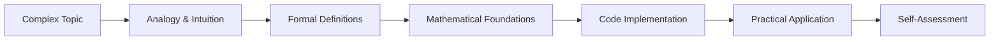
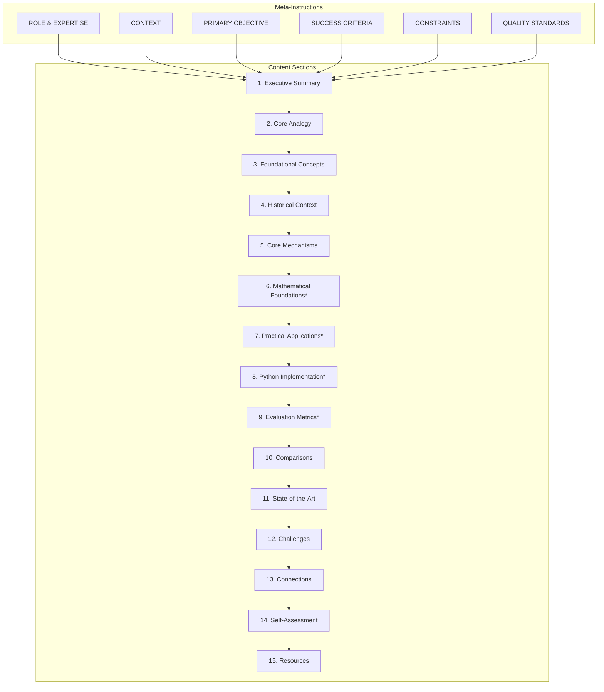

# Deep Research Study Guide Generator - Documentation

> **Version:** 3.0  
> **Last Updated:** November 25, 2025  
> **Files:** `prompt_deep_research.md` (v2.0), `prompt_deep_research_v3.md` (v3.0 - recommended)

---

## Table of Contents

- [Overview](#overview)
- [Quick Start](#quick-start)
- [Prompt Architecture](#prompt-architecture)
- [Section Reference](#section-reference)
- [Usage Examples](#usage-examples)
- [Customization Guide](#customization-guide)
- [Quality Checklist](#quality-checklist)
- [Troubleshooting](#troubleshooting)

---

## Overview

### Purpose

The Deep Research Study Guide Generator is a specialized prompt template designed to create comprehensive, pedagogically-sound technical study guides. It transforms complex data science and machine learning topics into structured learning materials with:

- **Intuitive explanations** using analogies and real-world examples
- **Mathematical foundations** with proper LaTeX notation
- **Practical code examples** in Python
- **Curated resources** spanning papers, videos, and documentation

### Target Audience

| Audience | Use Case |
|----------|----------|
| **Data Scientists** | Learning new algorithms, techniques, or tools |
| **ML Engineers** | Understanding theoretical foundations for implementation |
| **Technical Writers** | Creating educational content from research |
| **Educators** | Developing curriculum materials |

### Design Principles



1. **Build intuition first** - Abstract concepts become concrete through analogies
2. **Progressive complexity** - Foundational → Advanced → Cutting-edge
3. **Active learning** - Self-assessment questions without answers
4. **Verifiable accuracy** - All claims require authoritative sources

---

## Quick Start

### Basic Usage

1. Copy the prompt from `prompt_deep_research.md`
2. Replace `[YOUR TOPIC HERE]` with your subject
3. Submit to a capable LLM (GPT-4, Claude, Gemini Pro)

### Example Input

```markdown
## TOPIC

Gradient Boosting: From Theory to XGBoost Implementation
```

### Expected Output

A 3000-5000 word study guide containing:
- Executive summary with learning roadmap
- Core analogy for intuition building
- 4-8 foundational concept definitions
- Historical timeline (3-5 milestones)
- Architecture diagrams (Mermaid)
- Mathematical equations (LaTeX)
- Python implementation (20-50 lines)
- Comparison tables with alternatives
- 5-7 curated resources per category

---

## Prompt Architecture

### Structure Overview



*Sections marked with * are conditional

### Section Classification

| Type | Sections | Inclusion Rule |
|------|----------|----------------|
| **Required** | 1, 2, 3, 4, 5, 10, 12, 13, 14, 15 | Always included |
| **Conditional** | 6, 7, 8, 9, 11 | Based on topic characteristics |

### Conditional Logic

```
Section 6 (Math):
  IF topic.involves(quantitative_methods OR algorithms OR statistical_models)
  THEN include
  ELSE skip

Section 7 (Applications):
  IF NOT topic.is_purely_theoretical
  THEN include
  ELSE skip

Section 8 (Python):
  IF topic.is(algorithm OR library OR tool) AND topic.has_code_implementation
  THEN include
  ELSE skip

Section 9 (Metrics):
  IF topic.performance.is_objectively_measurable
  THEN include
  ELSE skip
```

---

## Section Reference

### Section 1: Executive Summary & Learning Roadmap

**Purpose:** Orient the reader and set expectations

**Components:**
- One-sentence definition
- Business/technical significance
- Target users and applications
- Learning journey preview (3-5 steps)

**Word Count:** 150-250 words

**Example Output:**
> This guide covers **Transformer attention mechanisms**, the core innovation enabling modern large language models like GPT and BERT. Understanding attention is crucial for anyone working with NLP...
>
> **Learning Journey:**
> 1. Build intuition with a relatable analogy
> 2. Master the mechanics (queries, keys, values)
> 3. See it in action through code examples
> 4. Make informed decisions via comparisons

---

### Section 2: Building Intuition (Core Analogy)

**Purpose:** Make abstract concepts tangible

**Requirements:**
- Single, powerful real-world analogy
- Accessible to non-technical audiences
- Explicit limitations of the analogy

**Format:** `"[Topic] is like [familiar concept] because..."`

**Critical Element:** Must explain where the analogy breaks down

---

### Section 3: Foundational Concepts

**Purpose:** Establish shared vocabulary

**Structure per concept:**
1. Jargon-free definition (1-2 sentences)
2. Technical/formal notation
3. Simple example
4. Relationship to main topic

**Count:** 4-8 concepts, ordered fundamental → advanced

---

### Section 4: Historical Context & Evolution

**Purpose:** Show the "why" behind current state

**Milestones:**
1. Pre-history (what came before)
2. Origin (introduction)
3. Key developments (2-4)
4. Current state

**Per milestone:** Year, change, developer, problem solved

---

### Section 5: Core Mechanisms & Architecture

**Purpose:** Deep technical explanation

**Diagram Types (Mermaid):**
- System architecture
- Data flow
- Process workflow
- Component relationships

**Requirements:**
- Written explanation per diagram
- Key insights highlighted
- Component interactions explained

---

### Section 6: Mathematical Foundations *(Conditional)*

**Include when:** Topic involves quantitative methods, algorithms, or statistical models

**Per equation:**
- LaTeX notation
- Plain language interpretation
- Variable definitions
- Use case explanation

**Count:** 3-7 equations, foundational → advanced

**LaTeX Format:**
- Inline: `$equation$`
- Display: `$$equation$$`

---

### Section 7: Practical Applications *(Conditional)*

**Include when:** Topic is NOT purely theoretical

**Per application:**
- Industry/domain
- Specific problem solved
- How technology is applied
- Measurable outcomes
- Companies using it (if public)

**Count:** 3-5 applications

---

### Section 8: Python Implementation *(Conditional)*

**Include when:** Topic is a concrete algorithm, library, or tool

**Requirements:**
- 20-50 lines
- Self-contained (all imports)
- Well-commented
- Realistic sample data
- Expected output description

---

### Section 9: Evaluation Metrics *(Conditional)*

**Include when:** Performance is objectively measurable

**Per metric:**
- Name and abbreviation
- What it measures
- Formula/calculation
- Typical ranges/benchmarks
- When to prioritize

**Count:** 4-7 metrics

---

### Section 10: Comparisons & Trade-offs

**Purpose:** Enable informed decision-making

**Table Structure:**
| Aspect | Main Topic | Alternative 1 | Alternative 2 |
|--------|------------|---------------|---------------|
| Performance | ... | ... | ... |
| Complexity | ... | ... | ... |
| Use Cases | ... | ... | ... |
| Cost/Resources | ... | ... | ... |
| Learning Curve | ... | ... | ... |

**Additional:** "When to use" guidance for each option

---

### Section 11: State-of-the-Art & Future Trends

**Purpose:** Connect to cutting-edge developments

**Recent Advancements (3-5):**
- What changed
- Who developed it
- Why it matters
- Adoption status

**Future Trends (2-4):**
- Problem aimed to solve
- Current obstacles
- Expected timeline

---

### Section 12: Challenges & Common Pitfalls

**Purpose:** Prevent common mistakes

**Challenges (4-6):**
- Description
- Why it occurs
- Mitigation strategies
- Severity level

**Misconceptions (2-4):**
- Incorrect belief
- Why it's wrong
- Correct understanding

---

### Section 13: Connections to Existing Knowledge

**Purpose:** Build knowledge network

**Connections (3-5):**
- Related domain/concept
- Type of relationship
- Practical implications
- Transfer of understanding

**Order:** Prerequisites → Peers → Advanced applications

---

### Section 14: Learning Aids & Self-Assessment

**Part A - Key Takeaways:**
- 5-7 bullet points
- One sentence each
- Actionable/memorable

**Part B - Self-Assessment:**
- 2 conceptual questions (why)
- 2 practical questions (how)
- 1 synthesis question (connect ideas)
- **NO ANSWERS PROVIDED**

---

### Section 15: Curated Learning Resources

**Categories:**

| Category | Count | Requirements |
|----------|-------|--------------|
| Seminal Papers | 3-5 | Authors, year, citation count |
| Articles/Blogs | 2-4 | Authoritative sources, mix of depths |
| Visual Resources | 1-3 | Diagrams, infographics, animations |
| Video Content | 2-3 | Channel name, duration, style |
| Documentation/Code | 2-3 | Official docs, GitHub repos |

**Per resource:**
- Full title
- Direct URL
- 1-sentence annotation
- Difficulty level (Beginner/Intermediate/Advanced)

---

## Usage Examples

### Example 1: Algorithm-Focused Topic

**Input:**
```markdown
## TOPIC
Random Forests: Ensemble Learning for Classification and Regression
```

**Sections Included:** All 15 (topic is quantitative, has code, is measurable)

**Expected Emphasis:**
- Mathematical foundations (Gini impurity, entropy, information gain)
- Python implementation (scikit-learn example)
- Evaluation metrics (accuracy, F1, feature importance)
- Comparison with Decision Trees, XGBoost, Neural Networks

---

### Example 2: Conceptual Topic

**Input:**
```markdown
## TOPIC
Transfer Learning: Leveraging Pre-trained Models for Domain Adaptation
```

**Sections Included:** 1-5, 7, 10-15 (skip math-heavy sections 6, 8, 9)

**Expected Emphasis:**
- Strong analogy (knowledge transfer between domains)
- Historical evolution (ImageNet → BERT → Foundation Models)
- Practical applications across industries
- Comparisons with training from scratch

---

### Example 3: Tool/Library Focus

**Input:**
```markdown
## TOPIC
Pandas DataFrames: Efficient Data Manipulation in Python
```

**Sections Included:** 1-5, 7, 8, 10, 12-15 (skip math, metrics)

**Expected Emphasis:**
- Detailed Python implementation examples
- Common pitfalls (SettingWithCopyWarning, memory issues)
- Comparison with NumPy, Polars, Dask

---

## Customization Guide

### Adjusting Word Count

Modify in `<quality_standards>`:
```markdown
**Content Depth:**
- Total length: 3000-5000 words  ← Change this
```

**Recommendations:**
| Topic Complexity | Word Count |
|------------------|------------|
| Simple concept | 2000-3000 |
| Standard topic | 3000-5000 |
| Complex system | 5000-7000 |

### Changing Target Audience

Modify in `<context>`:
```markdown
Target audience: Data scientists (intermediate to advanced level)
```

**Options:**
- `beginners in machine learning`
- `software engineers learning ML`
- `researchers exploring new domains`
- `technical managers evaluating solutions`

### Adding Custom Sections

Insert after Section 15:
```markdown
## 16. [Your Custom Section]

**Requirements:**
- [Your specific requirements]
- [Additional guidelines]

**Format:**
[Your format specification]
```

### Removing Sections

Add to `<constraints>` under FORBIDDEN:
```markdown
- Do NOT include Section X (reason)
```

Or modify Required/Conditional section lists.

---

## Quality Checklist

Use this checklist to validate generated study guides:

### Content Quality

- [ ] Executive summary is 150-250 words
- [ ] Core analogy includes limitations
- [ ] All technical terms defined on first use
- [ ] Historical timeline has 3-5 milestones with years
- [ ] Mermaid diagrams render correctly
- [ ] LaTeX equations display properly
- [ ] Python code is runnable (test it)
- [ ] Comparison table has 5+ aspects
- [ ] Self-assessment has no answers provided

### Source Quality

- [ ] All URLs are functional
- [ ] Papers include authors and year
- [ ] Resources are from last 3-5 years (unless historical)
- [ ] No paywalled content without warning
- [ ] Official documentation linked where applicable

### Formatting

- [ ] Main sections use `##` headings
- [ ] Code blocks have language identifiers
- [ ] Tables are properly formatted
- [ ] Blockquotes used for examples
- [ ] Consistent terminology throughout

### Completeness

- [ ] All required sections present (1-5, 10, 12-15)
- [ ] Conditional sections correctly included/excluded
- [ ] 3000-5000 word total length
- [ ] 5+ resources per category in Section 15

---

## Troubleshooting

### Common Issues

| Issue | Cause | Solution |
|-------|-------|----------|
| Output too short | Model truncation | Split into multiple requests or increase token limit |
| Missing sections | Ambiguous topic | Be more specific in topic description |
| Generic examples | Lack of context | Add domain context to topic |
| Broken LaTeX | Model formatting | Specify LaTeX compatibility in system message |
| Placeholder text | Incomplete generation | Re-run or break into smaller sections |

### Model-Specific Notes

**GPT-4/GPT-4o:**
- Excellent at following structure
- May need reminder for Mermaid syntax
- Strong LaTeX support

**Claude:**
- Prefers XML tags (already included)
- Excellent at analogies
- May over-explain; remind of word limits

**Gemini Pro:**
- Strong with visual descriptions
- May need explicit Mermaid formatting reminders
- Good at code examples

### Optimizing Results

1. **Provide topic context:**
   ```markdown
   ## TOPIC
   Attention Mechanisms in NLP: From Bahdanau to Multi-Head Self-Attention
   
   Focus on: transformer architectures, not computer vision applications
   Audience context: Team transitioning from RNN-based models
   ```

2. **Request specific sections first:**
   > "Generate sections 1-5 first, then continue with remaining sections"

3. **Iterate on weak sections:**
   > "Section 8 code example is too basic. Expand to show multi-head attention implementation with batching."

---

## Version History

| Version | Date | Changes |
|---------|------|---------|
| 3.0 | November 2025 | Added quick reference, section decision matrix, multi-model guidance, output validation checklist, scope guidance, structured topic input, dynamic date placeholder |
| 2.0 | October 2025 | Added success criteria, quality standards, Gemini-specific guidelines |
| 1.0 | Initial | Original prompt structure |

---

## V2 → V3 Migration Guide

### Key Differences

| Aspect | V2 | V3 |
|--------|----|----|
| **Date handling** | Hardcoded `October 24, 2025` | Dynamic `{{ current_date }}` |
| **Quick start** | None | Quick Reference section at top |
| **Section 11** | Unclear when to include | Explicit conditional criteria |
| **Model support** | Gemini-only notes | GPT-4, Claude, Gemini guidance |
| **Topic input** | Simple placeholder | Structured with scope/depth options |
| **Validation** | Quality standards only | Full output validation checklist |
| **Scope** | Implicit | Explicit in-scope/out-of-scope lists |

### Migration Steps

1. Replace `prompt_deep_research.md` content with `prompt_deep_research_v3.md`
2. Update any automation that parses the prompt structure
3. Test with 2-3 topics to verify output quality

---

## Related Files

| File | Purpose |
|------|---------|
| `prompt_deep_research.md` | Original prompt template (v2.0) |
| `prompt_deep_research_v3.md` | **Recommended** - Optimized prompt (v3.0) |
| `analysis_project.chatmode.md` | Project analysis agent |
| `document_project.agent.md` | Documentation generator agent |
| `prompt_optimizer_agent.chatmode.md` | Prompt optimization system |

---

*Documentation for Prompts_collection repository*
