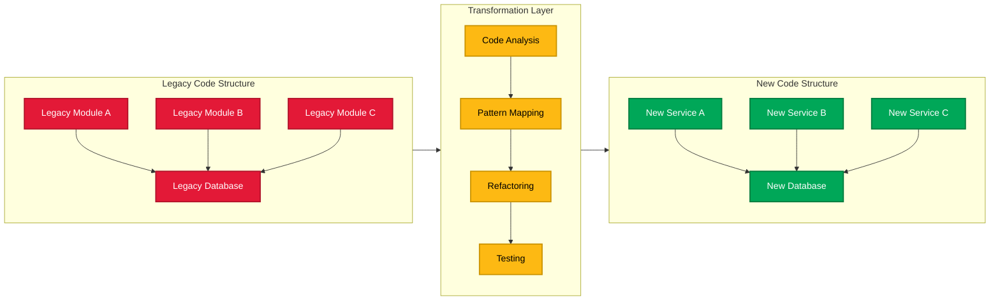
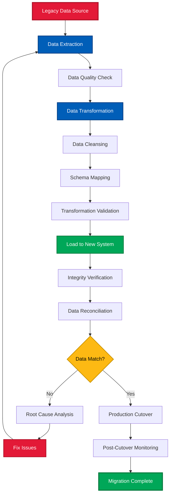
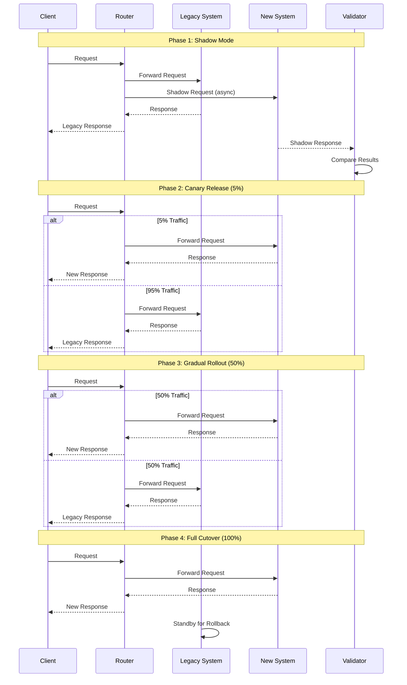

# Legacy Code Migration Review - Comprehensive Documentation

**Version**: 1.0.0  
**Last Updated**: December 22, 2025  
**Status**: Production Ready ✅

---

## Table of Contents

1. [Overview](#overview)
2. [Migration Review Process](#migration-review-process)
3. [Architecture Comparison Framework](#architecture-comparison-framework)
4. [Migration Flows & Diagrams](#migration-flows--diagrams)
5. [Checkpoint System: Legacy vs New](#checkpoint-system-legacy-vs-new)
6. [Best Practices & Recommendations](#best-practices--recommendations)
7. [Tools & Templates](#tools--templates)
8. [Case Studies](#case-studies)
9. [FAQ](#faq)

---

## Overview

### Purpose

This documentation provides a comprehensive framework for reviewing and validating code migrations from legacy systems to modern architectures. It ensures that business logic is preserved, data integrity is maintained, and the new system meets or exceeds the legacy system's capabilities while addressing technical debt and improving overall system quality.

### When to Use This Framework

Use this framework when:
- Migrating from legacy languages/frameworks to modern alternatives
- Refactoring monolithic applications into microservices
- Upgrading major framework or runtime versions with breaking changes
- Replatforming applications to cloud-native architectures
- Transitioning between different technology stacks
- Modernizing applications while maintaining business continuity

### Key Objectives

1. **Functional Parity Validation**: Ensure all critical business functionality is preserved
2. **Risk Identification**: Detect potential issues before production deployment
3. **Quality Assessment**: Measure improvements in code quality, performance, and security
4. **Documentation**: Create comprehensive migration documentation
5. **Knowledge Transfer**: Facilitate team onboarding and system understanding
6. **Decision Support**: Provide clear go/no-go recommendations for production deployment

---

## Migration Review Process

### 10-Phase Review Framework

The migration review follows a systematic 10-phase approach to ensure comprehensive coverage of all critical aspects.

#### Phase 1: Pre-Migration Analysis
**Objective**: Build complete understanding of legacy system

**Key Activities**:
- Document legacy technology stack
- Map core business functionality
- Identify critical code paths
- Review existing documentation
- Catalog known issues and technical debt
- Define migration success criteria

**Deliverables**:
- Legacy System Profile document
- Critical functionality inventory
- Technical debt assessment

**Estimated Time**: 10% of total review effort

---

#### Phase 2: Migration Scope Validation
**Objective**: Verify what is included in the migration

**Key Activities**:
- Analyze new system architecture
- Map legacy components to new components
- Identify what was migrated vs. deferred
- Document intentional breaking changes
- Verify migration strategy alignment

**Deliverables**:
- New System Profile document
- Component mapping matrix
- Migration scope statement

**Estimated Time**: 5% of total review effort

---

#### Phase 3: Functional Parity Verification
**Objective**: Ensure all business logic is correctly migrated

**Key Activities**:
- Side-by-side code comparison
- Business logic validation
- Algorithm preservation check
- Edge case handling verification
- Error handling comparison

**Deliverables**:
- Functional parity matrix
- Gap analysis report
- Remediation recommendations

**Estimated Time**: 20% of total review effort

**Critical Success Factor**: This is the most important phase - thorough execution is essential.

---

#### Phase 4: Data Flow Analysis
**Objective**: Validate data migration and transformations

**Key Activities**:
- Schema comparison
- Data transformation logic review
- Data integrity validation
- Data flow diagram creation
- Migration testing results analysis

**Deliverables**:
- Data migration report
- Data flow diagrams
- Data integrity test results

**Estimated Time**: 15% of total review effort

---

#### Phase 5: Integration Points Review
**Objective**: Ensure all integrations work correctly

**Key Activities**:
- API/Interface compatibility check
- External dependency analysis
- Integration testing review
- Backward compatibility assessment
- Consumer migration path documentation

**Deliverables**:
- Integration compatibility matrix
- Dependency comparison report
- Consumer migration guide

**Estimated Time**: 10% of total review effort

---

#### Phase 6: Performance & Security Analysis
**Objective**: Validate performance and security posture

**Key Activities**:
- Performance benchmark comparison
- Security vulnerability assessment
- Compliance validation
- Resource utilization analysis
- Security best practices review

**Deliverables**:
- Performance comparison report
- Security assessment report
- Compliance checklist

**Estimated Time**: 15% of total review effort

---

#### Phase 7: Testing & Quality Assurance
**Objective**: Assess test coverage and code quality

**Key Activities**:
- Test coverage analysis
- Code quality metrics comparison
- Static analysis review
- Test quality assessment
- Identify missing tests

**Deliverables**:
- Test coverage report
- Code quality comparison
- Test gap analysis

**Estimated Time**: 10% of total review effort

---

#### Phase 8: Documentation Review
**Objective**: Ensure adequate documentation exists

**Key Activities**:
- Architecture documentation review
- API documentation validation
- Operations documentation check
- Migration documentation assessment
- Knowledge transfer material review

**Deliverables**:
- Documentation completeness checklist
- Documentation gap analysis
- Documentation improvement plan

**Estimated Time**: 5% of total review effort

---

#### Phase 9: Risk Assessment & Recommendations
**Objective**: Identify and mitigate migration risks

**Key Activities**:
- Risk identification and analysis
- Impact assessment
- Mitigation strategy development
- Rollback planning
- Monitoring plan creation

**Deliverables**:
- Risk matrix
- Mitigation strategies
- Rollback plan
- Monitoring recommendations

**Estimated Time**: 5% of total review effort

---

#### Phase 10: Final Review Report
**Objective**: Synthesize findings and provide recommendation

**Key Activities**:
- Executive summary creation
- Overall assessment
- Go/no-go recommendation
- Action items prioritization
- Timeline estimation

**Deliverables**:
- Executive summary
- Detailed findings report
- Production readiness recommendation
- Action item list with owners

**Estimated Time**: 5% of total review effort

---

## Architecture Comparison Framework

### Architectural Pattern Comparison

#### Monolithic to Microservices Migration

**Legacy Architecture: Monolithic**
```
┌─────────────────────────────────────────┐
│        Monolithic Application           │
│  ┌──────────┐  ┌──────────┐            │
│  │   Auth   │  │ Business │            │
│  │  Module  │  │  Logic   │            │
│  └──────────┘  └──────────┘            │
│  ┌──────────┐  ┌──────────┐            │
│  │   Data   │  │   API    │            │
│  │  Access  │  │  Layer   │            │
│  └──────────┘  └──────────┘            │
└─────────────────────────────────────────┘
           ↓
    Single Database
```

**New Architecture: Microservices**
```
                ┌──────────────┐
                │  API Gateway │
                └──────────────┘
                        │
        ┌───────────────┼───────────────┐
        ↓               ↓               ↓
┌──────────────┐ ┌──────────────┐ ┌──────────────┐
│Auth Service  │ │Business Svc  │ │Report Service│
└──────────────┘ └──────────────┘ └──────────────┘
        ↓               ↓               ↓
   [Auth DB]       [Business DB]   [Report DB]
```

**Key Considerations**:
- Service boundary definition
- Data consistency across services
- Inter-service communication patterns
- Distributed transaction handling
- Service discovery and orchestration
- Deployment complexity

**Validation Checklist**:
- [ ] Each microservice has clear, single responsibility
- [ ] Database per service pattern implemented correctly
- [ ] Inter-service communication uses async patterns where appropriate
- [ ] Service boundaries align with business domains
- [ ] Error handling across service boundaries implemented
- [ ] Distributed tracing capability exists

---

### Technology Stack Migration Patterns

#### Language/Framework Upgrade Migration

**Example: Python 2.7 → Python 3.11**

| Aspect | Legacy (Python 2.7) | New (Python 3.11) | Migration Consideration |
|--------|-------------------|------------------|------------------------|
| **Syntax** | print "text" | print("text") | Automated with 2to3 tool |
| **Unicode** | str vs unicode | str is unicode | String handling changes |
| **Division** | 5/2 = 2 | 5/2 = 2.5 | Integer division behavior |
| **Exceptions** | except Error, e: | except Error as e: | Syntax change |
| **Async** | Limited (Twisted) | Native async/await | Major capability addition |
| **Type Hints** | Not available | Available | New feature for code quality |

**Critical Validation Points**:
1. String encoding/decoding behavior
2. Integer division results
3. Dictionary iteration order (important in 3.7+)
4. Exception handling patterns
5. Third-party library compatibility
6. Performance characteristics

---

#### Framework Migration

**Example: Spring 4.x (Java 8) → Spring Boot 3.x (Java 17)**

| Component | Spring 4.x | Spring Boot 3.x | Impact |
|-----------|-----------|----------------|--------|
| **Configuration** | XML + Java Config | Java Config / YAML | Configuration refactoring |
| **Dependency Injection** | @Autowired | @Autowired + Constructor | Best practice change |
| **Web** | Spring MVC | Spring WebFlux option | Reactive programming available |
| **Security** | Spring Security 4 | Spring Security 6 | Major API changes |
| **Data Access** | JDBC Template | Spring Data JPA | Abstraction level change |
| **Testing** | JUnit 4 | JUnit 5 | Test framework upgrade |

**Migration Validation**:
- [ ] All XML configurations converted to Java/YAML
- [ ] Security configurations updated for new API
- [ ] Reactive programming properly implemented (if used)
- [ ] Spring Boot auto-configuration not hiding critical settings
- [ ] Actuator endpoints secured appropriately
- [ ] Tests updated to JUnit 5 patterns

---

## Migration Flows & Diagrams

### Overall Migration Process Flow

```mermaid
graph TB
    Start([Migration Initiated]) --> Assessment[Phase 1: Pre-Migration Assessment]
    Assessment --> Planning[Phase 2: Migration Planning]
    Planning --> Design[Architecture Design]
    Design --> ProofOfConcept[Proof of Concept]
    ProofOfConcept --> POCReview{POC Successful?}
    
    POCReview -->|No| DesignRevision[Revise Design]
    DesignRevision --> Design
    POCReview -->|Yes| Development[Development Phase]
    
    Development --> CodeReview[Code Review]
    CodeReview --> UnitTesting[Unit Testing]
    UnitTesting --> IntegrationTesting[Integration Testing]
    
    IntegrationTesting --> TestResults{Tests Pass?}
    TestResults -->|No| BugFix[Bug Fixes]
    BugFix --> Development
    TestResults -->|Yes| DataMigration[Data Migration]
    
    DataMigration --> DataValidation[Data Validation]
    DataValidation --> DataOK{Data Integrity OK?}
    DataOK -->|No| DataFix[Data Issues Resolution]
    DataFix --> DataMigration
    DataOK -->|Yes| UAT[User Acceptance Testing]
    
    UAT --> UATResult{UAT Passed?}
    UATResult -->|No| Refinement[Refinements]
    Refinement --> Development
    UATResult -->|Yes| PerfTest[Performance Testing]
    
    PerfTest --> PerfOK{Performance Acceptable?}
    PerfOK -->|No| Optimization[Performance Optimization]
    Optimization --> Development
    PerfOK -->|Yes| SecurityAudit[Security Audit]
    
    SecurityAudit --> SecOK{Security Approved?}
    SecOK -->|No| SecurityFix[Security Remediation]
    SecurityFix --> Development
    SecOK -->|Yes| MigrationReview[Comprehensive Migration Review]
    
    MigrationReview --> ReviewDecision{Review Recommendation?}
    ReviewDecision -->|Reject| CriticalFix[Address Critical Issues]
    CriticalFix --> Development
    ReviewDecision -->|Approve with Conditions| ConditionalWork[Complete Conditions]
    ConditionalWork --> MigrationReview
    ReviewDecision -->|Approve| StagingDeploy[Deploy to Staging]
    
    StagingDeploy --> StagingValidation[Staging Validation]
    StagingValidation --> StagingOK{Staging Validated?}
    StagingOK -->|No| StagingFix[Fix Staging Issues]
    StagingFix --> Development
    StagingOK -->|Yes| ProductionReadiness[Production Readiness Review]
    
    ProductionReadiness --> ProdReady{Ready for Production?}
    ProdReady -->|No| PreProdWork[Pre-Production Work]
    PreProdWork --> ProductionReadiness
    ProdReady -->|Yes| ProductionDeploy[Production Deployment]
    
    ProductionDeploy --> Monitoring[Active Monitoring]
    Monitoring --> MonitorPeriod{Monitoring Period Complete?}
    MonitorPeriod -->|Issues Found| Rollback{Critical Issues?}
    Rollback -->|Yes| RollbackAction[Rollback to Legacy]
    RollbackAction --> PostMortem[Post-Mortem Analysis]
    PostMortem --> Development
    Rollback -->|No| HotFix[Apply Hot Fixes]
    HotFix --> Monitoring
    MonitorPeriod -->|No Issues| Stabilization[Stabilization Period]
    
    Stabilization --> Final{Stable?}
    Final -->|No| Monitoring
    Final -->|Yes| LegacyDecommission[Legacy System Decommission]
    LegacyDecommission --> Complete([Migration Complete])
    
    style Start fill:#00A758,stroke:#007a3d,stroke-width:3px,color:#ffffff
    style Assessment fill:#005EB8,stroke:#003d82,stroke-width:2px,color:#ffffff
    style Planning fill:#005EB8,stroke:#003d82,stroke-width:2px,color:#ffffff
    style Development fill:#005EB8,stroke:#003d82,stroke-width:2px,color:#ffffff
    style MigrationReview fill:#FDB913,stroke:#c99200,stroke-width:3px,color:#000000
    style ProductionDeploy fill:#00A758,stroke:#007a3d,stroke-width:3px,color:#ffffff
    style Complete fill:#00A758,stroke:#007a3d,stroke-width:3px,color:#ffffff
    style Rollback fill:#E31937,stroke:#b01229,stroke-width:2px,color:#ffffff
    style RollbackAction fill:#E31937,stroke:#b01229,stroke-width:3px,color:#ffffff
```



### Code Migration Pattern Flow



### Data Migration Flow



### Parallel Run Strategy



---

## Checkpoint System: Legacy vs New

### Functional Checkpoint Matrix

This matrix provides a systematic way to track functional parity across all critical business functions.

| Checkpoint ID | Function Name | Legacy Location | New Location | Status | Verification Method | Notes |
|---------------|---------------|----------------|--------------|--------|-------------------|-------|
| FN-001 | User Authentication | `auth/login.py:45-120` | `services/auth/login.go:30-85` | ✅ Full | Unit + Integration Tests | Performance improved 2x |
| FN-002 | Password Reset | `auth/reset.py:150-200` | `services/auth/reset.go:100-140` | ✅ Full | Unit + E2E Tests | Email template updated |
| FN-003 | Order Processing | `orders/process.py:300-450` | `services/orders/processor.go:200-320` | ⚠️ Partial | Unit Tests Only | Missing bulk order handling |
| FN-004 | Payment Gateway | `payments/gateway.py:500-700` | `services/payments/gateway.go:350-520` | ✅ Full | Integration Tests | Added retry logic |
| FN-005 | Report Generation | `reports/gen.py:100-250` | `services/reports/generator.go:80-180` | ❌ Missing | N/A | Scheduled for Sprint 3 |
| FN-006 | Data Export | `export/csv.py:50-150` | `services/export/csv.go:40-110` | 🔄 Modified | Unit + Manual Tests | Added JSON export option |

**Status Legend**:
- ✅ **Full Parity**: Completely implemented, all tests passing
- ⚠️ **Partial Parity**: Core functionality present, edge cases or optimizations missing
- ❌ **Missing**: Not yet implemented
- 🔄 **Modified**: Intentionally changed with documented business justification

**Verification Methods**:
- **Unit Tests**: Function-level testing
- **Integration Tests**: Cross-component testing
- **E2E Tests**: Full workflow testing
- **Manual Tests**: Human verification required
- **Performance Tests**: Benchmarking and profiling

---

### Data Checkpoint Matrix

Track data migration and schema changes systematically.

| Entity | Legacy Schema | New Schema | Migration Status | Record Count | Data Quality | Notes |
|--------|---------------|------------|------------------|--------------|--------------|-------|
| Users | `users` table (PostgreSQL 9.6) | `users` collection (MongoDB 6.0) | ✅ Complete | 1,250,000 → 1,250,000 | ✅ 100% | Validation passed |
| Orders | `orders` table (PostgreSQL 9.6) | `orders` table (PostgreSQL 15) | ✅ Complete | 5,000,000 → 5,000,000 | ✅ 99.99% | 50 records manually reviewed |
| Products | `products` table | `products` + `product_metadata` | ⚠️ In Progress | 100,000 → 98,500 | ⚠️ 98.5% | 1,500 records need cleanup |
| Audit Logs | File-based logs | `audit_events` (Elasticsearch) | ✅ Complete | N/A (streaming) | ✅ Verified | Enhanced searchability |
| Sessions | Redis (v5) | Redis (v7) | ✅ Complete | Active sessions only | ✅ Verified | Clean migration |

**Data Quality Criteria**:
- ✅ **100%**: All records migrated correctly
- ⚠️ **95-99%**: Minor issues identified and documented
- ❌ **<95%**: Requires remediation before production

---

### Integration Checkpoint Matrix

Validate all external and internal integration points.

| Integration | Type | Legacy Endpoint | New Endpoint | Compatible? | Consumer Impact | Migration Plan |
|-------------|------|----------------|--------------|-------------|-----------------|----------------|
| Payment API | External | `/api/v1/payment` | `/api/v2/payment` | ⚠️ v1 deprecated | Medium | v1 supported for 6 months |
| Email Service | External | SMTP direct | SendGrid API | ✅ Backward compatible | None | Configuration change only |
| CRM Sync | Internal | REST `/sync` | Event-driven (Kafka) | ❌ Breaking | High | CRM team must update |
| Analytics | Internal | Batch exports | Real-time streaming | ✅ Both supported | Low | Gradual migration |
| Mobile App | Consumer | REST `/api/v1/*` | GraphQL `/graphql` | ⚠️ v1 maintained | Medium | Mobile v2 required for new features |

**Consumer Impact Levels**:
- **None**: Zero impact, transparent to consumers
- **Low**: Minor configuration changes
- **Medium**: Code changes required, timeline flexible
- **High**: Significant changes, coordination required

---

### Performance Checkpoint Matrix

Compare performance metrics between legacy and new systems.

| Operation | Legacy Performance | New Performance | Target | Status | Notes |
|-----------|-------------------|-----------------|--------|--------|-------|
| User Login | 250ms (p50) | 150ms (p50) | <200ms | ✅ | 40% improvement |
| Search Query | 800ms (p95) | 600ms (p95) | <700ms | ✅ | Elasticsearch upgrade |
| Order Submit | 1.2s (p50) | 1.5s (p50) | <1.0s | ❌ | Needs optimization |
| Report Gen | 5.0s (p50) | 3.5s (p50) | <4.0s | ✅ | Async processing added |
| Bulk Import | 50 rec/sec | 200 rec/sec | >100 rec/sec | ✅ | Parallel processing |
| API Throughput | 500 req/sec | 800 req/sec | >600 req/sec | ✅ | Better concurrency |

**Status Indicators**:
- ✅ **Meets Target**: Performance meets or exceeds target
- ⚠️ **Close to Target**: Within 10% of target, acceptable
- ❌ **Below Target**: Requires optimization before production

---

### Security Checkpoint Matrix

Track security posture improvements and regressions.

| Security Control | Legacy | New | Status | Priority | Notes |
|------------------|--------|-----|--------|----------|-------|
| Authentication | Basic Auth | OAuth 2.0 + JWT | ✅ Improved | High | Multi-factor available |
| Authorization | Role-based (RBAC) | Attribute-based (ABAC) | ✅ Improved | High | More granular control |
| Data Encryption (at rest) | None | AES-256 | ✅ Improved | Critical | Compliance requirement |
| Data Encryption (in transit) | TLS 1.1 | TLS 1.3 | ✅ Improved | Critical | Security best practice |
| SQL Injection Prevention | Parameterized queries | ORM + Parameterized | ✅ Maintained | Critical | Double protection |
| XSS Prevention | Basic sanitization | Content Security Policy | ✅ Improved | High | Additional header security |
| Secrets Management | Config files | Vault (HashiCorp) | ✅ Improved | Critical | No hardcoded secrets |
| Audit Logging | File-based | Centralized (SIEM) | ✅ Improved | High | Better traceability |
| Session Management | Server-side | Token-based | 🔄 Changed | Medium | Requires client updates |
| API Rate Limiting | None | Implemented | ✅ Improved | Medium | DDoS protection |

**Status Legend**:
- ✅ **Improved**: Security posture better than legacy
- 🔄 **Changed**: Different approach, neutral security impact
- ⚠️ **Maintained**: Same level of security
- ❌ **Degraded**: Security regression (must be fixed)

---

## Best Practices & Recommendations

### Migration Strategy Selection

#### Strangler Fig Pattern (Recommended for Most Migrations)

**Description**: Gradually replace parts of the legacy system with new implementations while both systems run in parallel.

**Best For**:
- Large, complex legacy systems
- Business-critical applications with zero downtime requirement
- Teams with limited resources
- Risk-averse organizations

**Advantages**:
- Lowest risk approach
- Incremental validation
- Easy rollback at any point
- Business continuity maintained

**Implementation Steps**:
1. Identify boundaries in legacy system
2. Create anti-corruption layer
3. Implement new functionality in new system
4. Route specific requests to new system
5. Gradually increase traffic to new system
6. Decommission legacy components one by one

**Timeline**: 6-18 months typically

---

#### Big Bang Migration

**Description**: Complete migration happens in a single cutover event.

**Best For**:
- Small applications
- Systems with acceptable downtime windows
- Tightly coupled systems that can't be decomposed
- Migrations with hard deadlines (e.g., EOL events)

**Advantages**:
- Faster overall timeline
- No parallel systems to maintain
- Simpler architecture during migration
- Lower total cost

**Disadvantages**:
- Higher risk
- Difficult to rollback
- Requires extensive testing
- Business disruption during cutover

**Implementation Steps**:
1. Complete new system development
2. Comprehensive testing in staging
3. Final data migration preparation
4. Scheduled downtime window
5. Execute cutover
6. Intensive post-cutover monitoring

**Timeline**: 3-9 months typically

---

#### Parallel Run Strategy

**Description**: Run legacy and new systems in parallel, comparing outputs before full cutover.

**Best For**:
- Financial systems
- Systems requiring high accuracy
- Compliance-heavy environments
- Data processing pipelines

**Advantages**:
- Highest confidence in correctness
- Issues detected before cutover
- Gradual traffic shift possible
- Easy rollback

**Disadvantages**:
- Highest cost (double infrastructure)
- Complex operational overhead
- Data synchronization complexity
- Extended timeline

**Implementation Steps**:
1. Deploy new system alongside legacy
2. Route read traffic to both systems
3. Compare outputs systematically
4. Fix discrepancies in new system
5. Gradually route write traffic
6. Final cutover after validation period

**Timeline**: 9-24 months typically

---

### Code Quality Improvement Recommendations

#### 1. Eliminate Technical Debt

**Priority Actions**:
- **Remove Dead Code**: Delete unused functions, classes, and files
  - Use code coverage tools to identify unused code
  - Remove commented-out code
  - Delete deprecated APIs
  
- **Simplify Complex Functions**: Break down large functions
  - Target: Functions < 50 lines
  - Single Responsibility Principle
  - Extract methods for clarity
  
- **Reduce Cyclomatic Complexity**: Simplify conditional logic
  - Target: Complexity < 10 per function
  - Replace nested conditions with guard clauses
  - Use polymorphism over conditionals

**Metrics to Track**:
```
Code Duplication: Target < 5%
Average Function Length: Target < 30 lines
Cyclomatic Complexity: Target < 10
Test Coverage: Target > 80%
```

---

#### 2. Implement Modern Patterns

**Design Patterns to Apply**:

**Dependency Injection**:
```python
# Legacy (tight coupling)
class OrderService:
    def __init__(self):
        self.db = DatabaseConnection()  # Hard dependency
        self.email = EmailService()

# New (loose coupling)
class OrderService:
    def __init__(self, db: Database, email: EmailSender):
        self.db = db  # Injected dependencies
        self.email = email
```

**Repository Pattern** (Data Access Abstraction):
```python
# Legacy (mixed concerns)
class OrderService:
    def create_order(self, order_data):
        sql = "INSERT INTO orders ..."  # Direct SQL
        db.execute(sql)

# New (separation of concerns)
class OrderService:
    def __init__(self, order_repo: OrderRepository):
        self.orders = order_repo
    
    def create_order(self, order_data):
        order = Order(**order_data)
        self.orders.save(order)  # Abstract data access
```

**Circuit Breaker** (Resilience):
```python
# For external service calls
@circuit_breaker(failure_threshold=5, timeout=60)
def call_payment_gateway(payment_data):
    # If 5 failures occur, circuit opens
    # Requests fail fast for 60 seconds
    return payment_gateway.process(payment_data)
```

---

#### 3. Enhance Error Handling

**Structured Error Handling**:
```python
# Legacy (poor error handling)
def process_order(order_id):
    try:
        order = get_order(order_id)
        process(order)
    except:  # Catch-all, loses context
        return None

# New (structured error handling)
class OrderError(Exception):
    """Base class for order-related errors"""
    pass

class OrderNotFoundError(OrderError):
    """Order does not exist"""
    pass

class PaymentFailedError(OrderError):
    """Payment processing failed"""
    pass

def process_order(order_id):
    try:
        order = get_order(order_id)
        process(order)
    except OrderNotFoundError as e:
        logger.error(f"Order not found: {order_id}", exc_info=True)
        raise
    except PaymentFailedError as e:
        logger.warning(f"Payment failed for order: {order_id}")
        # Trigger retry logic
        retry_payment(order_id)
    except Exception as e:
        logger.critical(f"Unexpected error: {order_id}", exc_info=True)
        alert_operations_team(e)
        raise
```

---

#### 4. Add Observability

**Logging Best Practices**:
```python
# Structured logging
logger.info("Order created", extra={
    "order_id": order.id,
    "user_id": order.user_id,
    "amount": order.total,
    "duration_ms": duration,
})
```

**Metrics to Collect**:
- Request rate
- Error rate
- Response time (p50, p95, p99)
- Resource utilization (CPU, memory)
- Business metrics (orders/hour, revenue)

**Distributed Tracing**:
- Implement OpenTelemetry
- Trace requests across services
- Identify bottlenecks
- Debug issues in production

---

### Performance Optimization Recommendations

#### 1. Database Optimization

**Query Optimization**:
- Add missing indexes
- Eliminate N+1 queries
- Use connection pooling
- Implement query caching
- Batch operations where possible

**Example**:
```python
# Legacy (N+1 problem)
orders = Order.all()
for order in orders:
    customer = Customer.find(order.customer_id)  # N queries

# New (eager loading)
orders = Order.all().prefetch_related('customer')  # 2 queries total
```

**Database Schema Improvements**:
- Normalize where over-denormalized
- Denormalize where over-normalized
- Archive old data
- Partition large tables
- Review and optimize indexes

---

#### 2. Caching Strategy

**Multi-Layer Caching**:
```
┌─────────────────┐
│  Application    │
│  (In-Memory)    │  ← L1 Cache (Fastest)
└─────────────────┘
         ↓
┌─────────────────┐
│  Redis/Memcached│  ← L2 Cache (Fast)
└─────────────────┘
         ↓
┌─────────────────┐
│    Database     │  ← Slower
└─────────────────┘
```

**Cache Strategy by Data Type**:
- **Static Data** (e.g., product catalog): Long TTL (hours/days)
- **User Sessions**: Medium TTL (minutes/hours)
- **Real-time Data** (e.g., stock prices): Short TTL (seconds) or no cache

**Cache Invalidation**:
```python
# Write-through caching
def update_product(product_id, data):
    product = Product.update(product_id, data)  # Database
    cache.set(f"product:{product_id}", product, ttl=3600)  # Cache
    return product

# Cache-aside pattern
def get_product(product_id):
    product = cache.get(f"product:{product_id}")
    if product is None:
        product = Product.find(product_id)  # Database
        cache.set(f"product:{product_id}", product, ttl=3600)
    return product
```

---

#### 3. Asynchronous Processing

**Offload Long-Running Tasks**:
```python
# Legacy (synchronous)
def create_order(order_data):
    order = Order.create(order_data)
    send_confirmation_email(order)  # Blocks request
    update_inventory(order)  # Blocks request
    notify_warehouse(order)  # Blocks request
    return order  # Slow response

# New (asynchronous)
def create_order(order_data):
    order = Order.create(order_data)
    
    # Queue background jobs
    queue.enqueue(send_confirmation_email, order.id)
    queue.enqueue(update_inventory, order.id)
    queue.enqueue(notify_warehouse, order.id)
    
    return order  # Fast response
```

**Use Message Queues**:
- RabbitMQ, Kafka, or AWS SQS
- Decouple services
- Handle traffic spikes
- Enable retry logic

---

### Security Enhancement Recommendations

#### 1. Implement Defense in Depth

**Multiple Security Layers**:
1. **Network Security**: Firewalls, VPCs, security groups
2. **Application Security**: Input validation, output encoding
3. **Authentication**: Multi-factor, strong password policies
4. **Authorization**: Principle of least privilege
5. **Data Security**: Encryption at rest and in transit
6. **Monitoring**: Security Information and Event Management (SIEM)

---

#### 2. Follow OWASP Top 10 Best Practices

**Injection Prevention**:
```python
# SQL Injection Prevention
# BAD
query = f"SELECT * FROM users WHERE username = '{username}'"

# GOOD
query = "SELECT * FROM users WHERE username = %s"
cursor.execute(query, (username,))
```

**XSS Prevention**:
```python
# BAD
html = f"<div>{user_input}</div>"

# GOOD
from html import escape
html = f"<div>{escape(user_input)}</div>"
```

**CSRF Prevention**:
```python
# Use CSRF tokens for state-changing operations
@csrf_protect
def update_profile(request):
    # Validates CSRF token
    pass
```

---

#### 3. Secrets Management

**Never Hardcode Secrets**:
```python
# BAD
DB_PASSWORD = "mypassword123"

# GOOD
import os
DB_PASSWORD = os.environ.get('DB_PASSWORD')

# BETTER
from vault_client import get_secret
DB_PASSWORD = get_secret('database/password')
```

**Use Secret Management Tools**:
- HashiCorp Vault
- AWS Secrets Manager
- Azure Key Vault
- Google Secret Manager

---

### Testing Recommendations

#### Test Pyramid Strategy

```
       ┌─────────┐
      /  E2E Tests  \     ← Few (slow, expensive)
     /    (10%)      \
    /─────────────────\
   /  Integration Tests \  ← Some (moderate speed)
  /       (30%)          \
 /───────────────────────\
/     Unit Tests          \  ← Many (fast, cheap)
\        (60%)            /
 \─────────────────────────/
```

**Test Coverage Targets**:
- Unit Tests: 80%+ code coverage
- Integration Tests: All critical paths
- E2E Tests: Core user journeys

---

#### Test Types and Examples

**Unit Tests**:
```python
def test_order_total_calculation():
    order = Order()
    order.add_item(price=10.00, quantity=2)
    order.add_item(price=5.00, quantity=1)
    assert order.total == 25.00
```

**Integration Tests**:
```python
def test_order_creation_workflow():
    # Tests multiple components together
    user = create_test_user()
    product = create_test_product()
    
    order = OrderService.create_order(
        user_id=user.id,
        items=[{"product_id": product.id, "quantity": 1}]
    )
    
    assert order.status == "pending"
    assert order.items[0].product_id == product.id
    
    # Verify database state
    db_order = Order.find(order.id)
    assert db_order is not None
```

**End-to-End Tests**:
```python
def test_complete_checkout_flow():
    # Tests entire user journey
    browser.visit("/products")
    browser.click("#product-123")
    browser.click("#add-to-cart")
    browser.visit("/checkout")
    browser.fill_in("credit_card", "4111111111111111")
    browser.click("#submit-order")
    
    assert browser.is_text_present("Order Confirmed")
```

---

### Documentation Best Practices

#### Essential Documentation

1. **Architecture Documentation**
   - System architecture diagram
   - Component interaction diagram
   - Data flow diagram
   - Deployment architecture
   - Technology stack overview

2. **API Documentation**
   - Endpoint specifications (OpenAPI/Swagger)
   - Request/response examples
   - Authentication requirements
   - Rate limiting details
   - Error codes and handling

3. **Development Guide**
   - Setup instructions
   - Build commands
   - Testing procedures
   - Coding standards
   - Contribution guidelines

4. **Operations Runbook**
   - Deployment procedures
   - Monitoring setup
   - Common issues and solutions
   - Incident response procedures
   - Escalation contacts

5. **Migration Documentation**
   - Migration strategy
   - Legacy vs. new comparison
   - Data migration procedures
   - Rollback plan
   - Known issues and workarounds

---

## Tools & Templates

### Migration Review Checklist Template

```markdown
# Migration Review Checklist

**Project**: _______________________
**Reviewer**: _____________________
**Date**: _________________________

## Phase 1: Pre-Migration Analysis
- [ ] Legacy system profile completed
- [ ] Core functionality documented
- [ ] Critical code paths identified
- [ ] Technical debt cataloged
- [ ] Migration scope defined

## Phase 2: New System Analysis
- [ ] New system profile completed
- [ ] Architecture pattern documented
- [ ] Component mapping created
- [ ] Technology stack verified

## Phase 3: Functional Parity
- [ ] All critical functions mapped
- [ ] Side-by-side comparison completed
- [ ] Business logic validated
- [ ] Edge cases verified
- [ ] Gap analysis documented

## Phase 4: Data Migration
- [ ] Schema comparison completed
- [ ] Data transformation validated
- [ ] Data integrity verified
- [ ] Migration testing successful
- [ ] Rollback procedure tested

## Phase 5: Integration Points
- [ ] API compatibility validated
- [ ] External dependencies reviewed
- [ ] Integration testing completed
- [ ] Consumer migration plan created

## Phase 6: Performance & Security
- [ ] Performance benchmarks completed
- [ ] Security audit performed
- [ ] Compliance requirements verified
- [ ] Vulnerability scan completed

## Phase 7: Testing & QA
- [ ] Test coverage adequate
- [ ] Code quality metrics acceptable
- [ ] Static analysis passed
- [ ] Test quality verified

## Phase 8: Documentation
- [ ] Architecture documentation complete
- [ ] API documentation complete
- [ ] Operations documentation complete
- [ ] Migration documentation complete

## Phase 9: Risk Assessment
- [ ] Risk matrix completed
- [ ] Mitigation strategies defined
- [ ] Rollback plan documented
- [ ] Monitoring plan created

## Phase 10: Final Report
- [ ] Executive summary written
- [ ] Recommendation provided
- [ ] Action items prioritized
- [ ] Timeline estimated

## Overall Recommendation
- [ ] ✅ APPROVED FOR PRODUCTION
- [ ] ⚠️ APPROVED WITH CONDITIONS
- [ ] ❌ NOT READY - REMEDIATION REQUIRED

**Conditions / Blockers**:
1. ___________________________
2. ___________________________
3. ___________________________
```

---

### Risk Assessment Template

```markdown
# Migration Risk Assessment

| Risk ID | Risk Description | Probability | Impact | Severity | Mitigation Strategy | Owner | Status |
|---------|-----------------|-------------|--------|----------|---------------------|-------|--------|
| R-001 | [Description] | High/Med/Low | High/Med/Low | Critical/High/Med/Low | [Strategy] | [Name] | [Status] |
| R-002 | [Description] | High/Med/Low | High/Med/Low | Critical/High/Med/Low | [Strategy] | [Name] | [Status] |

**Risk Severity Matrix**:
- **Critical**: High Probability + High Impact
- **High**: High Probability + Medium Impact OR Medium Probability + High Impact
- **Medium**: Medium Probability + Medium Impact OR Low Probability + High Impact
- **Low**: Low Probability + Low/Medium Impact
```

---

### Performance Comparison Template

```markdown
# Performance Comparison Report

**Test Date**: _________________
**Environment**: _______________
**Load Profile**: ______________

| Metric | Legacy | New | Change | Target | Status |
|--------|--------|-----|--------|--------|--------|
| Response Time (p50) | [X]ms | [Y]ms | [±Z%] | <[T]ms | ✅/❌ |
| Response Time (p95) | [X]ms | [Y]ms | [±Z%] | <[T]ms | ✅/❌ |
| Response Time (p99) | [X]ms | [Y]ms | [±Z%] | <[T]ms | ✅/❌ |
| Throughput | [X]/sec | [Y]/sec | [±Z%] | >[T]/sec | ✅/❌ |
| Error Rate | [X]% | [Y]% | [±Z%] | <[T]% | ✅/❌ |
| CPU Usage | [X]% | [Y]% | [±Z%] | <[T]% | ✅/❌ |
| Memory Usage | [X]MB | [Y]MB | [±Z%] | <[T]MB | ✅/❌ |

**Key Findings**:
- [Finding 1]
- [Finding 2]

**Recommendations**:
- [Recommendation 1]
- [Recommendation 2]
```

---

## Case Studies

### Case Study 1: E-commerce Platform Migration

**Background**:
- **Legacy**: PHP 5.6 monolithic application
- **New**: PHP 8.1 + Laravel microservices
- **Size**: 500K LOC, 50 developers
- **Timeline**: 18 months

**Approach**: Strangler Fig Pattern

**Key Challenges**:
1. Session management in distributed system
2. Database performance with increased load
3. Third-party integration compatibility

**Solutions**:
1. Implemented Redis for distributed sessions
2. Database query optimization and read replicas
3. Created adapter layer for legacy integrations

**Results**:
- Performance: 3x improvement in page load time
- Scalability: 10x increase in concurrent users
- Maintenance: 50% reduction in bug fix time
- Team Velocity: 40% increase in feature delivery

**Lessons Learned**:
- Start with edge services first (e.g., search, recommendations)
- Invest heavily in monitoring and observability
- Maintain feature parity before adding new features
- Communication with stakeholders is critical

---

### Case Study 2: Financial Services API Migration

**Background**:
- **Legacy**: .NET Framework 4.5, SOAP APIs
- **New**: .NET 7, REST + GraphQL APIs
- **Size**: 200K LOC, 15 developers
- **Timeline**: 12 months

**Approach**: Parallel Run Strategy

**Key Challenges**:
1. Regulatory compliance requirements
2. Zero error tolerance for financial calculations
3. Complex data validation rules

**Solutions**:
1. Comprehensive test suite (95% coverage)
2. Parallel run for 3 months with result comparison
3. Formal verification of calculation logic

**Results**:
- Accuracy: 100% parity with legacy system
- Performance: 5x improvement in API response time
- Cost: 60% reduction in hosting costs
- Developer Experience: Modern tooling and practices

**Lessons Learned**:
- Parallel run period was crucial for confidence
- Automated testing saved the project
- Don't underestimate data migration complexity
- Security audit early and often

---

## FAQ

### Q: How long should a migration typically take?

**A**: It varies widely based on:
- **System Size**: 10K LOC vs. 1M LOC
- **Team Size**: 5 developers vs. 50 developers
- **Business Risk**: Low risk vs. mission-critical
- **Strategy**: Big bang (3-9 months) vs. Strangler (6-24 months)

**Rule of Thumb**: For every 100K lines of legacy code, budget 3-6 months with a team of 10 developers.

---

### Q: Should we rewrite or refactor?

**A**: Decision matrix:

**Rewrite When**:
- Legacy code is unmaintainable
- Technology is completely obsolete
- Business requirements have fundamentally changed
- Performance issues can't be fixed with refactoring
- Team has no expertise in legacy technology

**Refactor When**:
- Business logic is well understood and working
- Can be done incrementally with low risk
- Team has legacy technology expertise
- Budget/time constraints
- System is business-critical

**Most projects**: Hybrid approach (refactor some, rewrite some)

---

### Q: How do we handle dependencies during migration?

**A**: Strategies:

1. **Dependency Inventory**: Create complete list of dependencies
2. **Update Strategy**: Update compatible dependencies first
3. **Replace Strategy**: Replace incompatible dependencies
4. **Adapter Pattern**: Create adapters for unavoidable incompatibilities
5. **Gradual Updates**: Don't update everything at once

**Best Practice**: Use dependency scanning tools (e.g., Snyk, Dependabot) to identify vulnerabilities.

---

### Q: What if we find critical issues late in the migration?

**A**: Options:

1. **Assess Impact**: How critical is the issue?
2. **Quick Fix**: Can it be fixed quickly without affecting timeline?
3. **Workaround**: Can we implement a temporary workaround?
4. **Defer**: Can the feature be deferred to post-launch?
5. **Rollback**: Is the issue severe enough to justify rollback?

**Prevention**: Comprehensive testing early and often, continuous integration, frequent reviews.

---

### Q: How do we maintain both legacy and new systems during migration?

**A**: Strategies:

1. **Feature Freeze**: Stop new features in legacy (recommended)
2. **Parallel Development**: Implement new features in both (expensive)
3. **New Features Only in New**: Incentivize cutover
4. **Critical Fixes Only**: Only fix critical bugs in legacy

**Recommendation**: Feature freeze on legacy, all new work in new system.

---

### Q: What metrics should we track during migration?

**A**: Key metrics:

**Development Metrics**:
- Migration progress (% of features migrated)
- Functional parity score
- Test coverage
- Bug count (legacy vs. new)

**Performance Metrics**:
- Response time
- Throughput
- Error rate
- Resource utilization

**Business Metrics**:
- User adoption of new system
- Support ticket volume
- Revenue impact
- Customer satisfaction

**Track weekly and report to stakeholders monthly.**

---

### Q: How do we ensure data consistency during migration?

**A**: Techniques:

1. **Validation Scripts**: Compare legacy and new data
2. **Checksums**: Verify data integrity
3. **Reconciliation Reports**: Identify mismatches
4. **Dual Writes**: Write to both systems during transition
5. **Event Sourcing**: Replay events in new system

**Best Practice**: Implement automated validation that runs continuously.

---

### Q: What's the best way to train the team on the new system?

**A**: Training plan:

1. **Documentation**: Comprehensive, up-to-date docs
2. **Code Walkthroughs**: Guided tours of new codebase
3. **Pair Programming**: Knowledge transfer through collaboration
4. **Hands-on Workshops**: Build features together
5. **Sandbox Environment**: Safe place to experiment
6. **Office Hours**: Regular Q&A sessions

**Timeline**: Start training 3 months before first cutover.

---

## Conclusion

Migrating from legacy code to modern systems is a complex undertaking that requires careful planning, systematic execution, and comprehensive validation. This documentation provides a structured framework for conducting thorough migration reviews, but success ultimately depends on:

1. **Clear Communication**: Stakeholders must understand risks and timelines
2. **Realistic Planning**: Don't underestimate complexity
3. **Incremental Progress**: Small, validated steps are better than big leaps
4. **Quality Focus**: Test thoroughly before production
5. **Team Readiness**: Invest in training and documentation
6. **Continuous Monitoring**: Watch for issues post-migration

**Remember**: The goal is not just to migrate code, but to improve the system's maintainability, performance, security, and ability to evolve with business needs.

---

**Document Version**: 1.0.0  
**Last Updated**: December 22, 2025  
**Maintained by**: @andresveraf  
**Feedback**: Please submit issues or suggestions to improve this documentation
