# Prompt Optimizer System - Complete Documentation

> **Version:** 2.1.0 | **Last Updated:** November 25, 2025 | **Status:** Production Ready

A comprehensive prompt engineering system for planning, creating, and optimizing prompts using 2025 best practices including context engineering, multi-agent patterns, and empirical validation.

## 📍 File Locations

| Format | Location | Use Case |
|--------|----------|----------|
| **Agent Mode** | `.github/agents/prompt_optimizer_agent.agentmode.md` | Primary agent deployment, VS Code integration |
| **Standalone** | `agents/prompt_optimizer_agent.md` | Standalone agent deployment, API integration |

Both versions contain identical content with different wrapper formats for their respective deployment environments.

---

## Table of Contents

1. [Quick Start](#-quick-start)
2. [System Overview](#-system-overview)
3. [Core Concepts](#-core-concepts)
4. [Techniques Reference](#-techniques-reference)
5. [Workflow Guide](#-workflow-guide)
6. [Templates & Examples](#-templates--examples)
7. [Quality Assurance](#-quality-assurance)
8. [Model-Specific Optimization](#-model-specific-optimization)
9. [Anti-Patterns](#-anti-patterns-to-avoid)
10. [Troubleshooting](#-troubleshooting)
11. [Version History](#-version-history)

---

## ⚡ Quick Start

### 5-Minute Prompt Creation

**Step 1: Copy this template**

```xml
<system>
You are a [ROLE] expert specializing in [DOMAIN].
Current date: 2025-11-25
</system>

<task>
[ONE_SENTENCE_OBJECTIVE]
</task>

<instructions>
1. [STEP_1]
2. [STEP_2]
3. [STEP_3]
</instructions>

<constraints>
MUST: [REQUIRED_1], [REQUIRED_2]
MUST NOT: [FORBIDDEN_1], [FORBIDDEN_2]
</constraints>

<output_format>
## [SECTION_1]
[CONTENT]

## [SECTION_2]
[CONTENT]
</output_format>

<input>
{{user_input}}
</input>
```

**Step 2: Fill in the blanks**

| Placeholder | What to Write | Example |
|-------------|---------------|---------|
| `[ROLE]` | Specific expertise | "customer support specialist" |
| `[DOMAIN]` | Area of focus | "ticket triage and classification" |
| `[ONE_SENTENCE_OBJECTIVE]` | Clear task goal | "Classify emails into predefined categories" |
| `[STEP_N]` | Specific actions | "Read email content carefully" |
| `[REQUIRED_N]` | Must-do behaviors | "Use only these categories: Technical, Billing, General" |
| `[FORBIDDEN_N]` | Must-not behaviors | "Never assign multiple categories" |

**Step 3: Test with 5 diverse examples**

```
Test 1: Typical case → Expected result? ✅/❌
Test 2: Another typical case → Expected result? ✅/❌
Test 3: Edge case (short input) → Expected result? ✅/❌
Test 4: Edge case (ambiguous) → Expected result? ✅/❌
Test 5: Error case (malformed) → Expected result? ✅/❌
```

**Step 4: Fix failures and repeat**

For each failure: Identify root cause → Add specific instruction → Retest

---

## 📋 System Overview

### What This System Does

```mermaid
flowchart LR
    A[User Need] --> B[Requirements Analysis]
    B --> C[Prompt Design]
    C --> D[Testing]
    D --> E{Pass Rate ≥90%?}
    E -->|No| F[Apply Techniques]
    F --> D
    E -->|Yes| G[Documentation]
    G --> H[Deploy]
```



### Core Capabilities

| Capability | Description | When to Use |
|------------|-------------|-------------|
| **Requirements Analysis** | Define success criteria before building | Every new prompt |
| **Context Engineering** | Structure context for optimal LLM understanding | Complex tasks, long inputs |
| **Techniques Catalog** | Apply proven patterns (CoT, Few-shot, etc.) | When accuracy < 90% |
| **Agent Patterns** | Design multi-agent and tool-using systems | Autonomous workflows |
| **Optimization Framework** | Systematic iteration based on failures | Improving existing prompts |
| **Quality Assurance** | Comprehensive testing and validation | Before production deployment |

### Decision Guide

```mermaid
flowchart TD
    A[Your Request] --> B{What do you need?}
    
    B -->|Create new prompt| C[Quick Start Template]
    B -->|Improve accuracy| D[Techniques Reference]
    B -->|Debug failures| E[Troubleshooting]
    B -->|Multi-step workflow| F[Agent Patterns]
    B -->|Production deploy| G[Quality Assurance]
    
    C --> H{Accuracy ≥90%?}
    H -->|Yes| I[✅ Deploy]
    H -->|No| D
    
    D --> J[Apply Technique]
    J --> H
```



---

## 🎯 Core Concepts

### 1. Context Engineering

The practice of structuring information for optimal LLM understanding.

#### Essential Context Checklist

```xml
<essential_context>
  <!-- TEMPORAL (When) -->
  Current date: {{ CURRENT_DATE }}
  
  <!-- ROLE (Who) -->
  You are a [EXPERTISE_DOMAIN] specialist with [EXPERIENCE_LEVEL] experience.
  
  <!-- TASK (What) -->
  Your objective is to [PRIMARY_ACTION] that [SUCCESS_CRITERION].
  
  <!-- CONSTRAINTS (Boundaries) -->
  MUST: [Required behaviors - be explicit]
  MUST NOT: [Forbidden behaviors - be explicit]
  
  <!-- OUTPUT (Format) -->
  Respond in [FORMAT] with [STRUCTURE].
</essential_context>
```

#### Key Principles

| Principle | Do This | Not This |
|-----------|---------|----------|
| **Explicit > Implicit** | "Use only: 'todo', 'done', 'failed'" | "Use appropriate values" |
| **Essential Only** | Include what's needed for the task | Include everything "just in case" |
| **Structured** | XML tags, clear sections | Free-form paragraphs |
| **Specific** | "150-200 words, 3 paragraphs" | "Keep it concise" |

#### Explicit Over Implicit Examples

```markdown
❌ BAD: "Handle errors properly"
✅ GOOD: "ERROR HANDLING: If tool fails, retry once with modified parameters. 
         If retry fails, return {status: 'failed', reason: '<specific error>'}."

❌ BAD: "Format the output nicely"
✅ GOOD: "Format as: H2 headers, bullet lists for items, code blocks for examples"

❌ BAD: "Be thorough but concise"
✅ GOOD: "Response length: 150-200 words. Include: problem, analysis, recommendation."
```

### 2. Success Criteria

**Define BEFORE building:**

```markdown
## Success Criteria Template

**Primary Metric**: [What matters most?]
- Example: Accuracy ≥ 90% on test set

**Secondary Metrics**: [What else matters?]
- Format compliance: 100%
- Latency: < 2 seconds
- Cost: < $0.01 per request

**Acceptable Trade-offs**:
- Accept +10% latency for +5% accuracy

**Failure Definition**:
- Critical: Wrong category assignment
- Acceptable: Minor formatting inconsistencies
```

### 3. Separation of Concerns

When context grows too complex, split into specialized components:

```markdown
SINGLE AGENT (Simple tasks):
User → Agent → Response

MULTI-AGENT (Complex workflows):
User → Parent Agent (Orchestration)
         ├── Child Agent 1 (Research)
         ├── Child Agent 2 (Analysis)
         └── Child Agent 3 (Output)
       → Synthesized Response
```

**When to use Multi-Agent:**
- Context exceeds 8K tokens
- Task requires different expertise areas
- Tool use with complex decision logic
- Reliability is critical (isolated failure domains)

---

## 📚 Techniques Reference

### Technique Selection Decision Tree

```mermaid
flowchart TD
    A[New Prompt Task] --> B{Task Complexity?}
    B -->|Simple/Well-defined| C[Zero-shot]
    B -->|Needs format examples| D[Few-shot 2-5]
    B -->|Multi-step reasoning| E[Chain-of-Thought]
    B -->|Multi-step workflow| F{Context Size?}
    F -->|<4K tokens| G[Prompt Chaining]
    F -->|>8K tokens| H[Multi-Agent]
    
    C --> I{Accuracy <90%?}
    I -->|Yes| D
    I -->|No| J[✅ Deploy]
    
    D --> K{Still <90%?}
    K -->|Yes| E
    K -->|No| J
    
    E --> L{Still failing?}
    L -->|Yes| F
    L -->|No| J
```



### Techniques by Tier

#### Tier 1: Foundational (Always Use)

**Clear and Direct Instructions**
```markdown
❌ BAD: "Tell me about dogs."

✅ GOOD: "Provide a 150-word overview of dog behavior focusing on:
1. Pack mentality and social hierarchy
2. Communication methods (barking, body language)
3. Common behavioral issues and solutions
Format as three distinct paragraphs with H3 headers."
```

**XML Tags for Structure**
```xml
<context>
[Background information the model needs]
</context>

<instructions>
[Step-by-step task description]
</instructions>

<constraints>
[Boundaries and requirements]
</constraints>

<output_format>
[Exact structure of expected response]
</output_format>
```

#### Tier 2: Advanced Reasoning

**Chain-of-Thought (CoT)**
```markdown
"Let's approach this step by step:

1. First, identify the key variables in the problem
2. Next, determine the relationships between variables
3. Then, calculate intermediate values
4. Finally, derive the final answer

Show your work for each step."
```

**Extended Thinking (Claude)**
```xml
<thinking>
Let me break this down systematically...
[Model reasons through the problem]
</thinking>

<answer>
Based on the analysis above...
[Final structured answer]
</answer>
```

**Few-Shot Learning**
```markdown
"Convert natural language to SQL queries.

Example 1:
Input: "Show me all customers from California"
Output: SELECT * FROM customers WHERE state = 'California';

Example 2:
Input: "Find total revenue by product category last year"
Output: 
SELECT category, SUM(revenue) as total_revenue
FROM sales
WHERE YEAR(sale_date) = YEAR(CURRENT_DATE) - 1
GROUP BY category;

Now convert: [User's query]"
```

**Example Selection Strategy:**
- Cover 2-5 diverse cases
- Include simple AND complex examples
- Show edge case handling
- Use domain-appropriate examples

**Self-Consistency**
```markdown
"Solve this problem using three different approaches:

Approach 1: [Method A]
Approach 2: [Method B]
Approach 3: [Method C]

Compare results and identify the most reliable answer.
If results conflict, explain the discrepancy."
```

#### Tier 3: Specialized

**Prompt Chaining**
```markdown
PROMPT 1 (Analysis):
"Analyze the customer feedback and extract:
1. Main themes (5-7 themes)
2. Sentiment distribution
3. Priority issues"

PROMPT 2 (Uses output from Prompt 1):
"Given these themes: {themes_from_prompt_1}
Create an action plan with:
- Immediate actions (< 1 week)
- Short-term initiatives (1-4 weeks)
- Long-term strategies (> 1 month)"

PROMPT 3 (Synthesis):
"Combine the analysis and action plan into an executive summary..."
```

**RAG Pattern**
```xml
<context>
[Retrieved documents, data, or knowledge base excerpts]
</context>

<instructions>
Using ONLY the information provided in the context above:
1. Answer the user's question
2. Cite specific passages that support your answer
3. If context is insufficient, state: "The provided context does not contain enough information to answer [specific aspect]."
</instructions>

<faithfulness_check>
Before finalizing, verify:
- Every claim is supported by the context
- No external knowledge was introduced
- Citations are accurate and specific
</faithfulness_check>
```

**Tree of Thoughts**
```markdown
"For this strategic decision, explore multiple paths:

BRANCH 1: If we prioritize cost reduction
- Implications: [...]
- Risks: [...]
- Expected outcome: [...]

BRANCH 2: If we prioritize quality improvement
- Implications: [...]
- Risks: [...]
- Expected outcome: [...]

Evaluate each branch against success criteria.
Recommend the optimal path with justification."
```

### Quick Reference Table

| Technique | Best For | Example Use Case | Complexity |
|-----------|----------|------------------|------------|
| **Zero-shot** | Simple, well-defined tasks | Translation, simple Q&A | Low |
| **Few-shot** | Format/style guidance | Custom data conversion | Medium |
| **Chain-of-Thought** | Complex reasoning | Math, logic puzzles | Medium |
| **Self-Consistency** | High-stakes accuracy | Medical, legal analysis | High |
| **RAG** | Knowledge-intensive tasks | Document Q&A, research | High |
| **Prompt Chaining** | Multi-step workflows | Analysis → Planning → Report | High |
| **Multi-Agent** | Complex autonomous tasks | Research systems | Very High |

---

## 🔄 Workflow Guide

### Time Allocation

| Phase | Time | Focus | Deliverable |
|-------|------|-------|-------------|
| **1. Requirements** | 10% | Success criteria, constraints | Requirements doc |
| **2. Design** | 20% | Template, context, examples | Initial prompt |
| **3. Testing** | 50% | Diverse inputs, iteration | Validated prompt |
| **4. Documentation** | 20% | Metrics, guidelines | Production package |

### Phase 1: Requirements Gathering

```markdown
## Requirements Checklist

### Business Context
- [ ] What is the task's purpose and business value?
- [ ] Who is the intended user/audience?
- [ ] What domain knowledge is required?

### Technical Requirements
- [ ] What are the input characteristics and constraints?
- [ ] What output format and structure are expected?
- [ ] What are the latency and cost constraints?

### Quality Requirements
- [ ] What defines success? (specific metrics)
- [ ] What are the critical failure modes to avoid?
- [ ] What is the acceptable error rate?

### Compliance
- [ ] Are there regulatory requirements?
- [ ] Are there content/safety guidelines?
```

### Phase 2: Initial Design

1. **Start with Quick Start Template** (above)
2. **Add domain-specific context**
3. **Include 2-3 examples** if task is non-obvious
4. **Specify exact output format**

### Phase 3: Testing & Refinement

**Test Dataset Composition:**
```markdown
Total: 20+ test cases

- Typical Cases (60%): 12-15 cases
  - Standard inputs that represent 80% of real usage
  
- Edge Cases (30%): 6-8 cases
  - Minimum/maximum input length
  - Ambiguous inputs
  - Missing information
  - Special characters
  
- Error Cases (10%): 2-4 cases
  - Malformed inputs
  - Out-of-scope requests
  - Contradictory instructions
```

**Iteration Protocol:**
```markdown
For each failure:
1. IDENTIFY: What went wrong?
   Input → Actual Output → Expected Output
   
2. HYPOTHESIZE: Why did it fail?
   - Missing instruction?
   - Ambiguous constraint?
   - Conflicting guidance?
   
3. FIX: Add specific instruction
   "CRITICAL: After completing each task, you MUST..."
   
4. TEST: Verify fix works
   - Run same failing case
   - Run 5 passing cases (check for side effects)
   
5. ITERATE: Move to next failure
```

### Phase 4: Validation & Documentation

**Pre-Deployment Checklist:**
```markdown
## Deployment Readiness

✅ TESTING
- [ ] 50+ test cases completed
- [ ] Accuracy ≥ 90% on typical cases
- [ ] Edge cases handled (≥ 70% pass rate)
- [ ] Zero critical failures

✅ DOCUMENTATION
- [ ] Design decisions documented
- [ ] Usage guidelines written
- [ ] Known limitations listed
- [ ] Version metadata added

✅ PRODUCTION
- [ ] Monitoring plan defined
- [ ] Rollback strategy documented
- [ ] Feedback collection mechanism
- [ ] Maintenance schedule set
```

---

## 📝 Templates & Examples

### Example 1: Customer Email Classifier

```xml
<system>
You are a customer support specialist expert specializing in ticket triage.
Current date: 2025-11-25
</system>

<task>
Classify incoming customer emails into predefined categories for routing.
</task>

<instructions>
1. Read the email content carefully
2. Identify the primary customer intent
3. Assign exactly ONE category from the allowed list
4. Provide confidence score (high/medium/low)
5. Extract key phrases that led to classification
</instructions>

<constraints>
MUST: 
- Use only these categories: Technical, Billing, Feature Request, General
- Assign exactly one category per email
- Provide reasoning for classification

MUST NOT:
- Assign multiple categories
- Make assumptions about customer identity
- Respond to the email content (classify only)
</constraints>

<output_format>
## Classification Result
- **Category**: [Technical|Billing|Feature Request|General]
- **Confidence**: [High|Medium|Low]
- **Key Indicators**: [2-3 phrases from email that led to this classification]
- **Routing Priority**: [Urgent|Normal|Low]
</output_format>

<input>
{{email_content}}
</input>
```

**Test Results:**
- Accuracy: 94%
- Format Compliance: 100%
- Avg Latency: 1.2s

### Example 2: Code Review Agent

```xml
<system>
You are a senior software engineer with 15 years of experience in security-focused code review.
Current date: 2025-11-25
</system>

<task>
Review the provided code for security vulnerabilities and best practice violations.
</task>

<instructions>
Let's approach this systematically:

1. First, identify the programming language and framework
2. Scan for common vulnerability patterns (OWASP Top 10)
3. Check for authentication/authorization issues
4. Review input validation and sanitization
5. Assess error handling and logging practices
6. Provide severity-ranked findings
</instructions>

<constraints>
MUST:
- Cite specific line numbers for each issue
- Provide severity rating (Critical/High/Medium/Low)
- Include remediation code examples
- Flag any false positives as "Potential" issues

MUST NOT:
- Report style issues as security vulnerabilities
- Provide generic advice without specific evidence
- Miss SQL injection, XSS, or auth bypass patterns
</constraints>

<output_format>
## Security Review Report

### Summary
- **Files Reviewed**: [count]
- **Critical Issues**: [count]
- **High Issues**: [count]
- **Medium/Low Issues**: [count]

### Critical Findings
#### [Finding Title]
- **Location**: [file:line]
- **Severity**: Critical
- **Description**: [explanation]
- **Vulnerable Code**:
```[language]
[code snippet]
```
- **Remediation**:
```[language]
[fixed code]
```

### Recommendations
[Prioritized action items]
</output_format>

<code>
{{code_to_review}}
</code>
```

### Example 3: Research Synthesis Agent

```xml
<system>
You are a research analyst specializing in synthesizing information from multiple sources.
Current date: 2025-11-25
</system>

<task>
Synthesize the provided research documents into a comprehensive analysis.
</task>

<instructions>
1. Read all provided documents carefully
2. Identify common themes and contradictions
3. Assess source credibility and recency
4. Synthesize findings into coherent narrative
5. Highlight areas of consensus and debate
6. Identify gaps in the research
</instructions>

<constraints>
MUST:
- Cite specific sources for each claim [Author, Year]
- Distinguish between established facts and emerging findings
- Note any methodological limitations
- Provide confidence levels for conclusions

MUST NOT:
- Introduce information not in the provided documents
- Present opinions as facts
- Ignore contradictory evidence
</constraints>

<output_format>
## Research Synthesis

### Executive Summary
[3-4 sentence overview]

### Key Findings
1. **[Finding]** - [Evidence summary] [Citations]
2. **[Finding]** - [Evidence summary] [Citations]
3. **[Finding]** - [Evidence summary] [Citations]

### Areas of Consensus
[What sources agree on]

### Areas of Debate
[Contradictory findings with source comparison]

### Research Gaps
[What remains unanswered]

### Confidence Assessment
| Finding | Confidence | Basis |
|---------|------------|-------|
| [Finding 1] | High/Medium/Low | [Reason] |

### Sources Reviewed
[Numbered list with credibility notes]
</output_format>

<documents>
{{research_documents}}
</documents>
```

---

## ✅ Quality Assurance

### Automated Scoring Formula

```
QUALITY_SCORE = (
    (Accuracy × 0.35) +
    (Format_Compliance × 0.25) +
    (Completeness × 0.20) +
    (Clarity × 0.10) +
    (Latency_Score × 0.10)
) × 20

Where:
- All metrics are on 1-5 scale
- Latency_Score: 5 if <2s, 4 if 2-5s, 3 if 5-10s, 2 if >10s
- Maximum possible score: 100
```

### Pass/Fail Gate Criteria

| Metric | Minimum | Target | Action if Below |
|--------|---------|--------|-----------------|
| Typical cases accuracy | 85% | 95% | Add examples, CoT |
| Edge cases handled | 70% | 90% | Add explicit handling |
| Format compliance | 90% | 100% | Strengthen format spec |
| Zero critical failures | Required | Required | Block deployment |
| Quality Score | 70/100 | 85/100 | Iterate on weakest area |

### Deployment Decision Matrix

| Scenario | Decision | Next Steps |
|----------|----------|------------|
| All minimums met + Score ≥70 | ✅ **READY** | Deploy with monitoring |
| 1-2 metrics below minimum | ⚠️ **NEEDS WORK** | Fix specific issues, retest |
| 3+ metrics below minimum | ❌ **NOT READY** | Major revision needed |
| Any critical failures | ❌ **BLOCKED** | Fix critical issues first |

### Evaluation Checklist

```markdown
## Pre-Deployment Validation

✅ CLARITY
- [ ] Role and objectives are unambiguous
- [ ] Instructions use simple, direct language
- [ ] Technical terms are defined or contextually clear

✅ COMPLETENESS
- [ ] All necessary context is provided
- [ ] Edge cases are addressed
- [ ] Error handling is specified
- [ ] Output format is clearly defined

✅ ACCURACY
- [ ] Examples demonstrate correct behavior
- [ ] Constraints prevent common errors
- [ ] Tested with 20+ diverse inputs

✅ ROBUSTNESS
- [ ] Handles malformed inputs gracefully
- [ ] Performs consistently across test cases
- [ ] Fails safely when encountering errors

✅ EFFICIENCY
- [ ] No redundant instructions
- [ ] Context is relevant and necessary
- [ ] Token usage is optimized
```

---

## 🔧 Model-Specific Optimization

### GPT-4 / GPT-4o

```markdown
Strengths:
- Complex reasoning and instruction following
- Long conversation context
- Function calling for tool use

Optimization Tips:
- Use detailed, structured instructions
- Leverage function calling for tool use
- Effective with chain-of-thought reasoning
- Can handle very long system prompts
```

### Claude (Anthropic)

```markdown
Strengths:
- Document analysis with explicit citations
- Following complex multi-step instructions
- Constitutional AI principles

Optimization Tips:
- Use XML tags for structure: <thinking>, <answer>, <instructions>
- Use prefilling to guide response format
- Add clear ethical guidelines
- Extended thinking for complex reasoning
```

**Prefill Example (Claude-specific):**
```
USER: "Analyze this code for security vulnerabilities."

ASSISTANT: "<analysis>
After careful review of the code, I identified the following security concerns:

1. "
```

### Gemini

```markdown
Strengths:
- Multimodal tasks (text + images)
- Real-time information synthesis
- Cost-effective with model selection

Optimization Tips:
- Use Flash for speed, Pro for complexity
- Effective with structured JSON outputs
- Good at following format specifications
- Select model based on task complexity
```

### Open Source (Llama, Mistral)

```markdown
Characteristics:
- More sensitive to prompt structure
- May need more examples (5-10 vs 2-3)
- Vocabulary affects performance

Optimization Tips:
- Use simpler vocabulary for smaller models
- Provide explicit format specification
- Test temperature and top-p settings carefully
- May need stronger constraints
```

---

## ❌ Anti-Patterns to Avoid

### 1. Kitchen Sink Prompt

```markdown
❌ PROBLEM: Adding every possible instruction "just in case"
   Impact: Context dilution, higher cost, confused outputs
   
✅ SOLUTION: Start minimal, add ONLY what testing proves necessary
   
Example:
❌ "Be helpful, accurate, concise, thorough, professional, friendly,
    detailed but not too long, cite sources when relevant..."
    
✅ "Provide a 150-word analysis with 3 key points and a recommendation."
```

### 2. Vague Success Criteria

```markdown
❌ PROBLEM: "Make it good" / "Be accurate" / "Write well"
   Impact: No way to measure, iterate, or know when done
   
✅ SOLUTION: Define specific, measurable criteria
   
Example:
❌ "The output should be high quality"
    
✅ "Success criteria:
    - Accuracy ≥90% on test set
    - Format compliance 100%
    - Response latency <2s"
```

### 3. Copy-Paste Examples

```markdown
❌ PROBLEM: Using generic examples that don't match your domain
   Impact: Model learns wrong patterns, fails on real inputs
   
✅ SOLUTION: Create domain-specific examples covering YOUR edge cases
   
Example:
❌ Using generic SQL examples for a healthcare data query task
    
✅ Creating examples with your actual table names, column types,
   and common query patterns from your domain
```

### 4. Implicit Expectations

```markdown
❌ PROBLEM: "Handle errors appropriately"
   Impact: LLM interprets differently than you expect
   
✅ SOLUTION: Specify exact error handling behavior
   
Example:
❌ "Handle missing data gracefully"
    
✅ "MISSING DATA HANDLING:
    - If required field is null: return {status: 'incomplete', missing: ['field_name']}
    - If optional field is null: proceed with default value
    - Log all missing data encounters"
```

### 5. No Testing Before Deploy

```markdown
❌ PROBLEM: "It worked on one example, ship it!"
   Impact: Edge cases fail in production, user trust erodes
   
✅ SOLUTION: Test 20+ cases before any deployment
   
Testing Minimum:
- 12-15 typical cases
- 5-8 edge cases
- 2-4 error scenarios
- Calculate pass rate before deploying
```

---

## 🔍 Troubleshooting

### Problem: Low Accuracy

| Symptom | Likely Cause | Solution |
|---------|--------------|----------|
| Wrong answers on simple cases | Unclear instructions | Add explicit step-by-step guidance |
| Fails on complex cases | Missing reasoning | Add Chain-of-Thought |
| Inconsistent results | Ambiguous criteria | Add specific examples (few-shot) |
| Domain-specific errors | Missing context | Add domain knowledge/terminology |

**Fix Process:**
1. Add Chain-of-Thought reasoning
2. Include 3-5 relevant examples
3. Provide more domain context
4. Break into simpler sub-tasks

### Problem: Inconsistent Outputs

| Symptom | Likely Cause | Solution |
|---------|--------------|----------|
| Format varies | Weak format spec | Add XML template with exact structure |
| Tone changes | No style guidelines | Add explicit tone/voice constraints |
| Length varies | No length limits | Specify exact word/sentence counts |

**Fix Process:**
1. Add explicit constraints and format specs
2. Use XML tags for structure
3. Provide examples showing desired behavior
4. Add validation instructions

### Problem: Context Too Long

| Symptom | Likely Cause | Solution |
|---------|--------------|----------|
| Truncated responses | Context limit hit | Remove redundant instructions |
| Early context forgotten | Attention limits | Use structured markers, priorities |
| High cost per request | Unnecessary content | Audit and trim context |

**Fix Process:**
1. Remove redundant instructions
2. Use references instead of repetition
3. Consider prompt chaining
4. Split into multi-agent architecture

### Problem: Edge Case Failures

| Symptom | Likely Cause | Solution |
|---------|--------------|----------|
| Empty input fails | No handling specified | Add explicit empty input instructions |
| Special chars break it | No sanitization | Add input validation rules |
| Ambiguous inputs wrong | No disambiguation | Add "when unclear" instructions |

**Fix Process:**
1. Explicitly list edge cases in prompt
2. Add conditional logic for special cases
3. Include edge case examples
4. Add error handling instructions

---

## 📋 Version Control Template

Use this template for production prompt management:

```yaml
prompt_metadata:
  name: "[prompt_name]_v[X.Y.Z]"
  version: "[X.Y.Z]"  # Major.Minor.Patch
  created: "YYYY-MM-DD"
  last_modified: "YYYY-MM-DD"
  author: "[team/person]"
  
  target_model:
    primary: "[model_name]"  # e.g., "claude-3.5-sonnet"
    compatible: ["model1", "model2"]
  
  performance_baseline:
    accuracy: "[X]%"
    format_compliance: "[X]%"
    avg_latency_ms: "[X]"
    cost_per_request: "$[X.XX]"
  
  changelog:
    - version: "1.1.0"
      date: "2025-11-25"
      changes: "Added edge case handling for empty inputs"
      test_results: "Accuracy: 94% → 97%"
      breaking: false
      
    - version: "1.0.0"
      date: "2025-11-20"
      changes: "Initial production release"
      test_results: "Accuracy: 94%, Format: 99%"
      breaking: false

  dependencies:
    - "[Required tool/API]"
    - "[Required context source]"
  
  known_limitations:
    - "[Limitation 1]"
    - "[Limitation 2]"
```

---

## 📜 Version History

### v2.1.0 (November 25, 2025)
- **Added agent mode version** in `agents/prompt_optimizer_agent.md`
- Now available in two formats: Chat Mode (VS Code) and Agent Mode (standalone)
- Added file location reference at top of documentation
- Both versions maintain feature parity with identical content

### v2.0.0 (November 2025)
- Added Quick Start section with instant template
- Added Decision Guide flowchart
- Added Anti-Patterns section (5 common mistakes)
- Added Version Control template for production
- Consolidated redundant sections
- Streamlined workflow phases with time allocation table
- Converted Quality Principles to compact table format

### v1.0.0 (October 2025)
- Initial release
- Based on 2025 prompt engineering research
- Context engineering principles
- Multi-agent system patterns
- Comprehensive testing framework

---

## 🔗 Quick Reference Links

| Resource | Purpose | Location |
|----------|---------|----------|
| **Prompt Files** | | |
| Agent Mode | Primary agent deployment | `.github/agents/prompt_optimizer_agent.agentmode.md` |
| Standalone Agent | API/standalone deployment | `agents/prompt_optimizer_agent.md` |
| **Documentation** | | |
| [Quick Start Template](#-quick-start) | Create prompt in 5 minutes | This document |
| [Decision Guide](#decision-guide) | Choose right approach | This document |
| [Techniques Reference](#-techniques-reference) | Apply advanced patterns | This document |
| [Templates & Examples](#-templates--examples) | Real-world examples | This document |
| [Troubleshooting](#-troubleshooting) | Fix common issues | This document |

---

## 💡 Key Takeaways

1. **Start Simple** - Use Quick Start template, add complexity only if needed
2. **Define Success First** - Metrics before building
3. **Test Early & Often** - 20+ diverse cases before deployment
4. **One Change at a Time** - Systematic iteration
5. **Document Everything** - Future you will thank present you

**Remember:** The best prompt is the simplest prompt that reliably achieves the success criteria.

---

*For questions or contributions, see the repository documentation.*
